```python
import numpy as np
import pandas as pd
import scanpy as sc
```


```python
sc.settings.verbosity = 3             # verbosity: errors (0), warnings (1), info (2), hints (3)
sc.logging.print_header()
sc.settings.set_figure_params(dpi=80, facecolor='white')
```

    scanpy==1.9.1 anndata==0.8.0 umap==0.5.3 numpy==1.21.6 scipy==1.8.0 pandas==1.4.2 scikit-learn==1.0.2 statsmodels==0.13.2 python-igraph==0.9.10 pynndescent==0.5.6


```python
results_file = 'write/pbmc3k.h5ad'  # the file that will store the analysis results
```

Data was downloaded from https://www.science.org/doi/10.1126/science.aat1699


```python
adata = sc.read_10x_mtx(
    '../data/aat1699_DataS1/',  # the directory with the `.mtx` file
    var_names='gene_symbols',   # use gene symbols for the variable names (variables-axis index)
    cache=True)                 # write a cache file for faster subsequent reading
```

    ... reading from cache file cache/..-data-aat1699_DataS1-matrix.h5ad


```python
adata.var_names_make_unique()  # this is u'nnecessary if using `var_names='gene_ids'` in `sc.read_10x_mtx`
```


```python
adata
```


    AnnData object with n_obs × n_vars = 125139 × 33694
        var: 'gene_ids'


```python
sc.pl.highest_expr_genes(adata, n_top=20, )
```

    normalizing counts per cell
        finished (0:00:00)


    
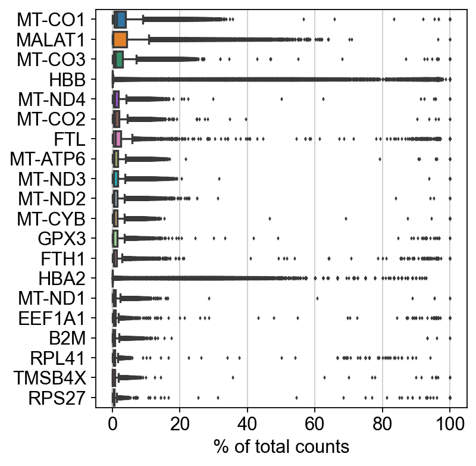
    


```python
sc.pp.filter_cells(adata, min_genes=200)
sc.pp.filter_genes(adata, min_cells=3)
```

    filtered out 29314 cells that have less than 200 genes expressed
    filtered out 6434 genes that are detected in less than 3 cells


```python
adata.var['mt'] = adata.var_names.str.startswith('MT-')  # annotate the group of mitochondrial genes as 'mt'
sc.pp.calculate_qc_metrics(adata, qc_vars=['mt'], percent_top=None, log1p=False, inplace=True)
```


```python
sc.pl.violin(adata, ['n_genes_by_counts', 'total_counts', 'pct_counts_mt'],
             jitter=0.4, multi_panel=True)
```


    
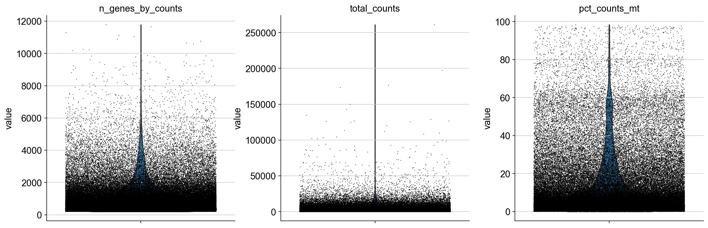
    


```python
sc.pl.scatter(adata, x='total_counts', y='pct_counts_mt')
sc.pl.scatter(adata, x='total_counts', y='n_genes_by_counts')
```


    
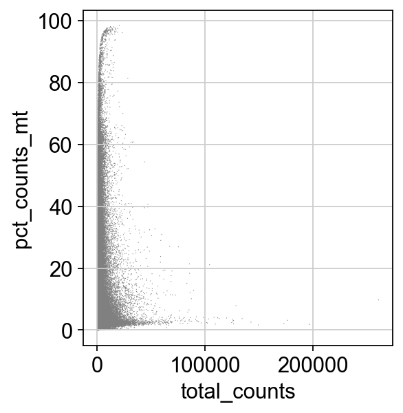
    


    
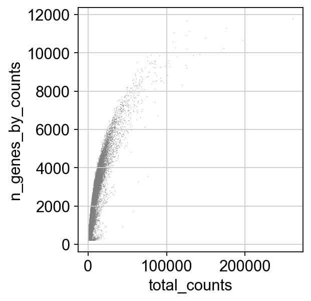
    


```python
adata = adata[adata.obs.n_genes_by_counts < 2500, :]
adata = adata[adata.obs.pct_counts_mt < 5, :]
```


```python
sc.pp.normalize_total(adata, target_sum=1e4)
```

    normalizing counts per cell


    /Users/aureliendugourd/opt/anaconda3/envs/sc/lib/python3.9/site-packages/scanpy/preprocessing/_normalization.py:170: UserWarning: Received a view of an AnnData. Making a copy.
      view_to_actual(adata)


        finished (0:00:00)


```python
sc.pp.log1p(adata)
```


```python
sc.pp.highly_variable_genes(adata, min_mean=0.0125, max_mean=3, min_disp=0.5)
```

    extracting highly variable genes
        finished (0:00:00)
    --> added
        'highly_variable', boolean vector (adata.var)
        'means', float vector (adata.var)
        'dispersions', float vector (adata.var)
        'dispersions_norm', float vector (adata.var)


```python
sc.pl.highly_variable_genes(adata)
```


    
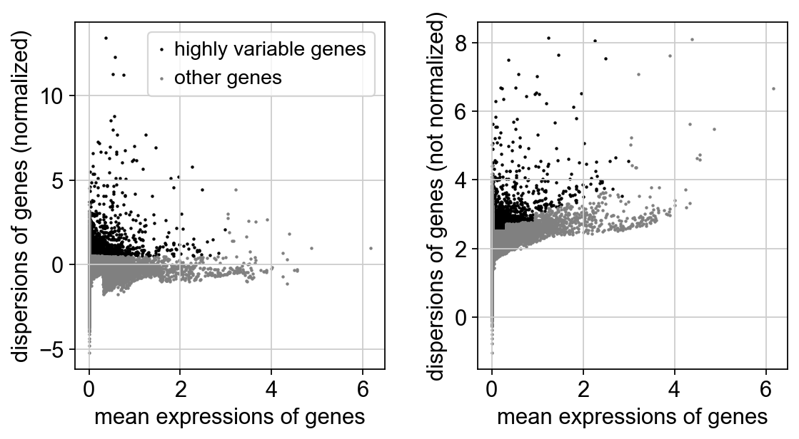
    


```python
adata.raw = adata
```


```python
adata = adata[:, adata.var.highly_variable]
```


```python
# sc.pp.regress_out(adata, ['total_counts', 'pct_counts_mt'])
```


```python
sc.pp.scale(adata, max_value=10)
```

    ... as `zero_center=True`, sparse input is densified and may lead to large memory consumption


    /Users/aureliendugourd/opt/anaconda3/envs/sc/lib/python3.9/site-packages/scanpy/preprocessing/_simple.py:843: UserWarning: Received a view of an AnnData. Making a copy.
      view_to_actual(adata)


```python
sc.tl.pca(adata, svd_solver='arpack')
```

    computing PCA
        on highly variable genes
        with n_comps=50
        finished (0:00:04)


```python
sc.pl.pca(adata, color='ASS1')
```


    
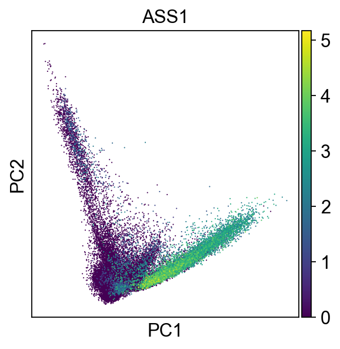
    


```python
sc.pl.pca_variance_ratio(adata, log=True)
```


    
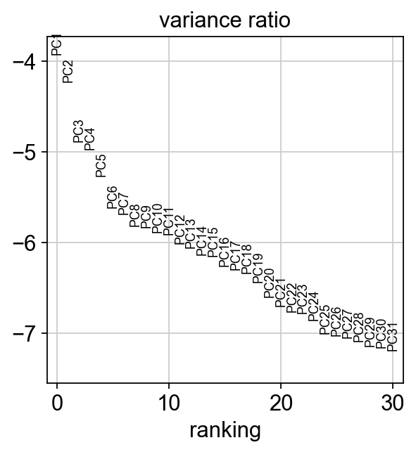
    


```python
sc.pp.neighbors(adata, n_neighbors=10, n_pcs=40)
```

    computing neighbors
        using 'X_pca' with n_pcs = 40
        finished: added to `.uns['neighbors']`
        `.obsp['distances']`, distances for each pair of neighbors
        `.obsp['connectivities']`, weighted adjacency matrix (0:00:06)


```python
sc.tl.umap(adata)
```

    computing UMAP
        finished: added
        'X_umap', UMAP coordinates (adata.obsm) (0:00:25)


```python
sc.pl.umap(adata, color=['ASS1'])
```


    
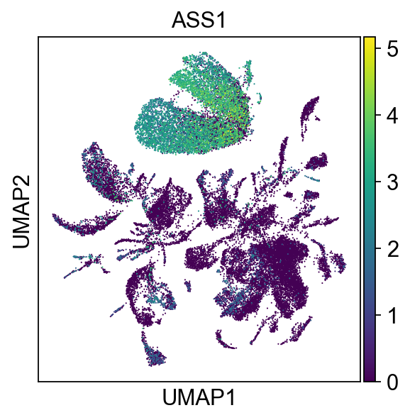
    


```python
#sc.tl.leiden(adata)
```


```python
# sc.pl.umap(adata, color=['leiden', 'ASS1'])
```


```python
import pandas as pd
```


```python
meta = pd.read_csv('../support/cell_annotations.csv', sep=";").set_index('DropletID')
# meta
```


```python
# adata.obs
```


```python
meta = meta.loc[adata.obs.index.intersection(meta.index)]
```


```python
# meta
```


```python
meta.Compartment.unique()
```


    array(['Normal_Epithelium_and_Vascular_without_PT', 'Normal_Immune',
           'Normal_Proximal_Tubules', 'Indistinct',
           'Tumour_Epithelium_and_Vascular', 'Tumour_Immune',
           'Foetal_Epithelium_and_Vascular', 'Foetal_Immune'], dtype=object)


```python
adata.obs = adata.obs.merge(meta, left_index=True, right_index=True)
```


```python
adata_filtered = adata[np.isin(adata.obs.Compartment, ['Normal_Epithelium_and_Vascular_without_PT','Tumour_Epithelium_and_Vascular','Normal_Proximal_Tubules','Normal_Immune','Tumour_Immune']) & ["RCC" in i for i in list(adata.obs.Source)] & ["pRCC" not in i for i in list(adata.obs.Source)]].raw.to_adata()

```


```python
adata_filtered
```


    AnnData object with n_obs × n_vars = 16076 × 27260
        obs: 'n_genes', 'n_genes_by_counts', 'total_counts', 'total_counts_mt', 'pct_counts_mt', 'barcode', 'SangerID', 'ClusterID', 'Compartment', 'nUMI', 'nGenes', 'MTfrac', 'QCpass', 'Source'
        var: 'gene_ids', 'n_cells', 'mt', 'n_cells_by_counts', 'mean_counts', 'pct_dropout_by_counts', 'total_counts', 'highly_variable', 'means', 'dispersions', 'dispersions_norm'
        uns: 'log1p', 'hvg', 'pca', 'neighbors', 'umap'
        obsm: 'X_pca', 'X_umap'
        obsp: 'distances', 'connectivities'


```python
sc.pp.highly_variable_genes(adata_filtered)
```

    extracting highly variable genes
        finished (0:00:00)
    --> added
        'highly_variable', boolean vector (adata.var)
        'means', float vector (adata.var)
        'dispersions', float vector (adata.var)
        'dispersions_norm', float vector (adata.var)


```python
adata_filtered.raw = adata_filtered
adata_filtered = adata_filtered[:, adata_filtered.var.highly_variable]
```


```python
sc.pp.scale(adata_filtered, max_value=10)
```

    ... as `zero_center=True`, sparse input is densified and may lead to large memory consumption


    /Users/aureliendugourd/opt/anaconda3/envs/sc/lib/python3.9/site-packages/scanpy/preprocessing/_simple.py:843: UserWarning: Received a view of an AnnData. Making a copy.
      view_to_actual(adata)


```python
sc.tl.pca(adata_filtered, svd_solver='arpack')
```

    computing PCA
        on highly variable genes
        with n_comps=50
        finished (0:00:03)


```python
sc.pp.neighbors(adata_filtered, n_neighbors=10, n_pcs=40)
```

    computing neighbors
        using 'X_pca' with n_pcs = 40
        finished: added to `.uns['neighbors']`
        `.obsp['distances']`, distances for each pair of neighbors
        `.obsp['connectivities']`, weighted adjacency matrix (0:00:00)


```python
sc.tl.umap(adata_filtered)
```

    computing UMAP
        finished: added
        'X_umap', UMAP coordinates (adata.obsm) (0:00:12)


```python
sc.set_figure_params(figsize=(15,15))
sc.pl.umap(adata_filtered, color=['Compartment', 'ASS1','EPAS1'], size=200)
```


    
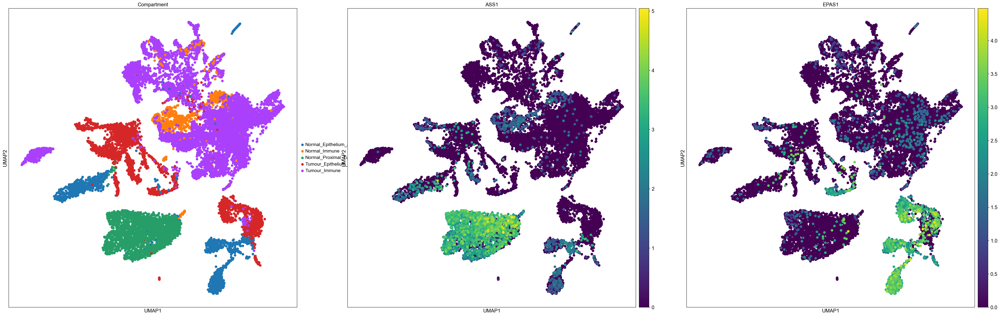
    


```python
sc.pl.umap(adata_filtered, color=['VIM','FN1'], size=200)
```


    
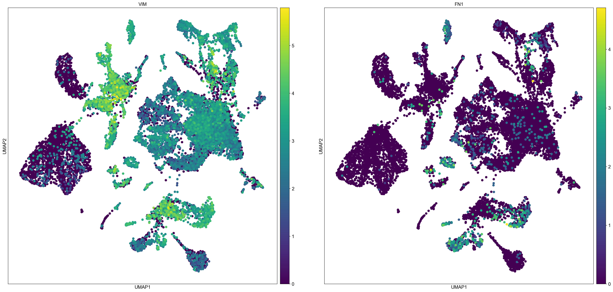
    


```python
list(adata_filtered.obs.Source.unique())
```


    ['RCC3_Kid_N_ldc_1_1',
     'RCC3_Kid_N_ldc_1_2',
     'RCC3_Kid_N_ldc_2_1',
     'RCC3_Kid_T_ldc_1_2',
     'RCC3_Kid_T_ldc_1_3',
     'RCC3_Kid_T_ldc_1_4',
     'RCC3_Ure_N_ldc_1_1',
     'RCC2_Kid_N_ldc_1_1',
     'RCC2_Kid_N_ldc_1_2',
     'RCC2_Kid_N_ldc_1_3',
     'RCC2_Kid_T_ldc_1_1',
     'RCC2_Kid_T_ldc_1_2',
     'RCC2_Kid_T_ldc_2_1',
     'RCC2_Kid_T_ldc_2_2',
     'RCC1_Kid_N_ldc_1_1',
     'RCC1_Kid_N_ldc_1_2',
     'RCC1_Kid_N_ldc_2_1',
     'RCC1_Kid_T_ldc_1_1',
     'RCC1_Kid_T_ldc_1_2',
     'RCC1_Kid_T_ldc_2_1',
     'RCC1_Kid_T_ldc_2_2',
     'RCC1_Ure_N_ldc_1_1']


```python
patient = "RCC1"
adata_filtered_patient = adata[np.isin(adata.obs.Compartment, ['Normal_Epithelium_and_Vascular_without_PT','Tumour_Epithelium_and_Vascular','Normal_Proximal_Tubules','Normal_Immune','Tumour_Immune']) & [patient in i for i in list(adata.obs.Source)]].raw.to_adata()
sc.pp.highly_variable_genes(adata_filtered_patient)
adata_filtered_patient.raw = adata_filtered_patient
adata_filtered_patient = adata_filtered_patient[:, adata_filtered_patient.var.highly_variable]
sc.pp.scale(adata_filtered_patient, max_value=10)
sc.tl.pca(adata_filtered_patient, svd_solver='arpack')
sc.pp.neighbors(adata_filtered_patient, n_neighbors=10, n_pcs=40)
sc.tl.umap(adata_filtered_patient)
sc.set_figure_params(figsize=(15,15))
sc.pl.umap(adata_filtered_patient, color=['Compartment', 'ASS1','EPAS1'], size=200)
```

    extracting highly variable genes
        finished (0:00:00)
    --> added
        'highly_variable', boolean vector (adata.var)
        'means', float vector (adata.var)
        'dispersions', float vector (adata.var)
        'dispersions_norm', float vector (adata.var)
    ... as `zero_center=True`, sparse input is densified and may lead to large memory consumption
    computing PCA
        on highly variable genes
        with n_comps=50


    /Users/aureliendugourd/opt/anaconda3/envs/sc/lib/python3.9/site-packages/scanpy/preprocessing/_simple.py:843: UserWarning: Received a view of an AnnData. Making a copy.
      view_to_actual(adata)


        finished (0:00:00)
    computing neighbors
        using 'X_pca' with n_pcs = 40
        finished: added to `.uns['neighbors']`
        `.obsp['distances']`, distances for each pair of neighbors
        `.obsp['connectivities']`, weighted adjacency matrix (0:00:00)
    computing UMAP
        finished: added
        'X_umap', UMAP coordinates (adata.obsm) (0:00:04)


    
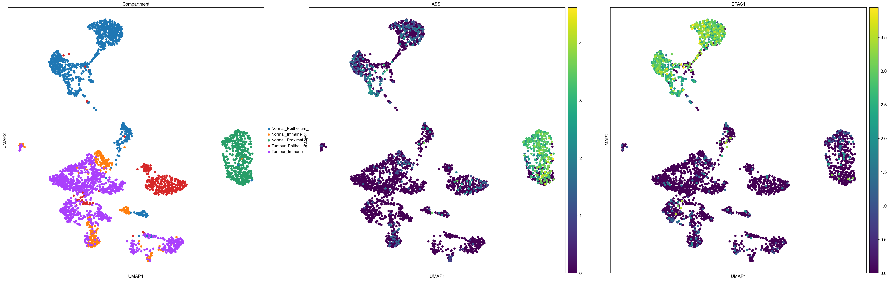
    


```python
patient = "RCC2"
adata_filtered_patient = adata[np.isin(adata.obs.Compartment, ['Normal_Epithelium_and_Vascular_without_PT','Tumour_Epithelium_and_Vascular','Normal_Proximal_Tubules','Normal_Immune','Tumour_Immune']) & [patient in i for i in list(adata.obs.Source)]].raw.to_adata()
sc.pp.highly_variable_genes(adata_filtered_patient)
adata_filtered_patient.raw = adata_filtered_patient
adata_filtered_patient = adata_filtered_patient[:, adata_filtered_patient.var.highly_variable]
sc.pp.scale(adata_filtered_patient, max_value=10)
sc.tl.pca(adata_filtered_patient, svd_solver='arpack')
sc.pp.neighbors(adata_filtered_patient, n_neighbors=10, n_pcs=40)
sc.tl.umap(adata_filtered_patient)
sc.set_figure_params(figsize=(15,15))
sc.pl.umap(adata_filtered_patient, color=['Compartment', 'ASS1','EPAS1'], size=200)
```

    extracting highly variable genes
        finished (0:00:00)
    --> added
        'highly_variable', boolean vector (adata.var)
        'means', float vector (adata.var)
        'dispersions', float vector (adata.var)
        'dispersions_norm', float vector (adata.var)
    ... as `zero_center=True`, sparse input is densified and may lead to large memory consumption


    /Users/aureliendugourd/opt/anaconda3/envs/sc/lib/python3.9/site-packages/scanpy/preprocessing/_simple.py:843: UserWarning: Received a view of an AnnData. Making a copy.
      view_to_actual(adata)


    computing PCA
        on highly variable genes
        with n_comps=50
        finished (0:00:02)
    computing neighbors
        using 'X_pca' with n_pcs = 40
        finished: added to `.uns['neighbors']`
        `.obsp['distances']`, distances for each pair of neighbors
        `.obsp['connectivities']`, weighted adjacency matrix (0:00:00)
    computing UMAP
        finished: added
        'X_umap', UMAP coordinates (adata.obsm) (0:00:07)


    
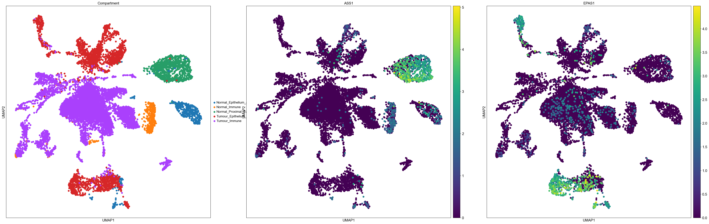
    


```python
patient = "RCC3"
adata_filtered_patient = adata[np.isin(adata.obs.Compartment, ['Normal_Epithelium_and_Vascular_without_PT','Tumour_Epithelium_and_Vascular','Normal_Proximal_Tubules','Normal_Immune','Tumour_Immune']) & [patient in i for i in list(adata.obs.Source)]].raw.to_adata()
sc.pp.highly_variable_genes(adata_filtered_patient)
adata_filtered_patient.raw = adata_filtered_patient
adata_filtered_patient = adata_filtered_patient[:, adata_filtered_patient.var.highly_variable]
sc.pp.scale(adata_filtered_patient, max_value=10)
sc.tl.pca(adata_filtered_patient, svd_solver='arpack')
sc.pp.neighbors(adata_filtered_patient, n_neighbors=10, n_pcs=40)
sc.tl.umap(adata_filtered_patient)
sc.set_figure_params(figsize=(15,15))
sc.pl.umap(adata_filtered_patient, color=['Compartment', 'ASS1','EPAS1'], size=200)
```

    extracting highly variable genes
        finished (0:00:00)
    --> added
        'highly_variable', boolean vector (adata.var)
        'means', float vector (adata.var)
        'dispersions', float vector (adata.var)
        'dispersions_norm', float vector (adata.var)
    ... as `zero_center=True`, sparse input is densified and may lead to large memory consumption
    computing PCA
        on highly variable genes
        with n_comps=50


    /Users/aureliendugourd/opt/anaconda3/envs/sc/lib/python3.9/site-packages/scanpy/preprocessing/_simple.py:843: UserWarning: Received a view of an AnnData. Making a copy.
      view_to_actual(adata)


        finished (0:00:00)
    computing neighbors
        using 'X_pca' with n_pcs = 40
        finished: added to `.uns['neighbors']`
        `.obsp['distances']`, distances for each pair of neighbors
        `.obsp['connectivities']`, weighted adjacency matrix (0:00:00)
    computing UMAP
        finished: added
        'X_umap', UMAP coordinates (adata.obsm) (0:00:02)


    
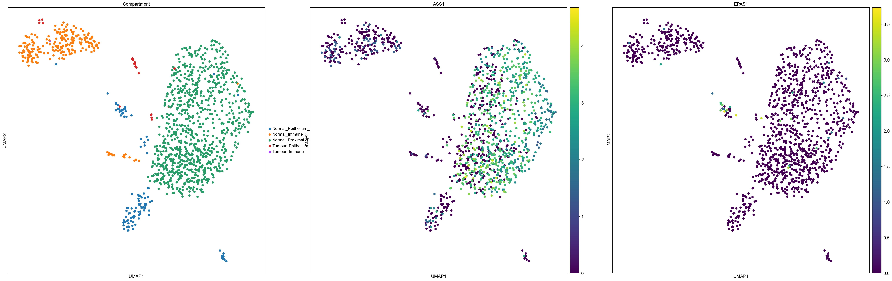
    


```python

```
