# Single cell analysis of CCRCC patient tumors with respect to normal tissue

## Aim of study

The goal of this analysis is to determine if tumor cells expressed ASS1. While it is known that the ASS1 gene is usually shutdown in CCRCC tumors, We posit that some cells may still be expressing ASS1, giving them the ability to metastasis. Wew use a single cell dataset obtained from Young et al.: https://www.science.org/doi/10.1126/science.aat1699

## Analysis

### Setting up environment


```python
import numpy as np
import pandas as pd
import scanpy as sc
import decoupler as dc
import matplotlib.pyplot as plt
import seaborn as sns
```


```python
sc.settings.verbosity = 3             # verbosity: errors (0), warnings (1), info (2), hints (3)
sc.logging.print_header()
sc.settings.set_figure_params(dpi=80, facecolor='white')
```

    scanpy==1.9.1 anndata==0.8.0 umap==0.5.3 numpy==1.21.5 scipy==1.7.3 pandas==1.4.2 scikit-learn==1.0.2 statsmodels==0.13.2 python-igraph==0.9.10 pynndescent==0.5.4


```python
results_file = 'write/pbmc3k.h5ad'  # the file that will store the analysis results
```

### Loading data

Data was downloaded from https://www.science.org/doi/10.1126/science.aat1699


```python
adata = sc.read_10x_mtx(
    '../data/aat1699_DataS1/',  # the directory with the `.mtx` file
    var_names='gene_symbols',   # use gene symbols for the variable names (variables-axis index)
    cache=True)                 # write a cache file for faster subsequent reading
```

    ... reading from cache file cache/..-data-aat1699_DataS1-matrix.h5ad


### Pre-processing data


```python
adata.var_names_make_unique()  # this is u'nnecessary if using `var_names='gene_ids'` in `sc.read_10x_mtx`
```


```python
adata
```


    AnnData object with n_obs × n_vars = 125139 × 33694
        var: 'gene_ids'


```python
meta = pd.read_csv('../support/cell_annotations.csv', sep=";").set_index('DropletID')
meta = meta.loc[adata.obs.index.intersection(meta.index)]
meta.Compartment.unique()
adata.obs = adata.obs.merge(meta, left_index=True, right_index=True)
```


```python
adata.obs.Source.unique()
```


    array(['Wilms3_Kid_N_C_ldc_1_1', 'Wilms3_Kid_N_M_ldc_1_1',
           'Wilms3_Kid_N_P_ldc_1_1', 'Wilms3_Kid_T_ldc_1_1',
           'Wilms3_Kid_T_ldc_1_2', 'Wilms3_Kid_T_ldc_1_3',
           'Wilms3_Ure_N_ldc_1_1', 'Wilms2_Kid_N_C_ldc_1_1',
           'Wilms2_Kid_N_M_ldc_1_1', 'Wilms2_Kid_N_P_ldc_1_1',
           'Wilms2_Kid_T_ldc_1_1', 'Wilms2_Kid_T_ldc_1_2',
           'Wilms2_Kid_T_ldc_1_3', 'Wilms2_Ure_N_ldc_1_1',
           'Wilms1_Kid_R_ldc_1_1', 'Wilms1_Kid_R_ldc_1_2',
           'Wilms1_Kid_R_ldc_1_3', 'Wilms1_Kid_N_ldc_1_1',
           'Wilms1_Kid_N_ldc_1_2', 'Wilms1_Kid_T_ldc_1_1',
           'Wilms1_Kid_T_ldc_1_2', 'Wilms1_Kid_T_ldc_1_3',
           'VHL_Kid_N_ldc_1_1', 'VHL_Kid_N_ldc_1_2', 'VHL_Kid_N_ldc_2_1',
           'VHL_Kid_N_ldc_2_2', 'VHL_Kid_T_ldc_1_1', 'VHL_Kid_T_ldc_1_2',
           'RCC3_Kid_N_ldc_1_1', 'RCC3_Kid_N_ldc_1_2', 'RCC3_Kid_N_ldc_2_1',
           'RCC3_Kid_T_ldc_1_1', 'RCC3_Kid_T_ldc_1_2', 'RCC3_Kid_T_ldc_1_3',
           'RCC3_Kid_T_ldc_1_4', 'RCC3_Ure_N_ldc_1_1', 'RCC2_Kid_N_ldc_1_1',
           'RCC2_Kid_N_ldc_1_2', 'RCC2_Kid_N_ldc_1_3', 'RCC2_Kid_T_ldc_1_1',
           'RCC2_Kid_T_ldc_1_2', 'RCC2_Kid_T_ldc_2_1', 'RCC2_Kid_T_ldc_2_2',
           'RCC1_Kid_N_ldc_1_1', 'RCC1_Kid_N_ldc_1_2', 'RCC1_Kid_N_ldc_2_1',
           'RCC1_Kid_T_ldc_1_1', 'RCC1_Kid_T_ldc_1_2', 'RCC1_Kid_T_ldc_2_1',
           'RCC1_Kid_T_ldc_2_2', 'RCC1_Ure_N_ldc_1_1', 'pRCC_Kid_N_ldc_1_1',
           'pRCC_Kid_N_ldc_1_2', 'pRCC_Kid_T_ldc_1_1', 'pRCC_Kid_T_ldc_1_2',
           'Trans_Kid_N_L_C_ldc_1_1', 'Trans_Kid_N_L_C_ldc_2_1',
           'Trans_Kid_N_L_M_ldc_1_1', 'Trans_Kid_N_L_M_ldc_2_1',
           'Trans_Kid_N_R_C_ldc_1_1', 'Trans_Kid_N_R_M_ldc_1_1',
           'F16_Kid_N_pos_1_1', 'F16_Kid_N_neg_1_1', 'F17_Kid_N_ldf_1_1',
           'F17_Kid_N_pos_1_1', 'F17_Kid_N_neg_1_1'], dtype=object)


There are 3 CCRCC patients, but it seems that something went wrong with the third patient. There is barelly any tumor cells. Thus we remove patient 3 and focus on patient 1 and 2.


```python
adata = adata[np.isin(adata.obs.Compartment, ['Normal_Epithelium_and_Vascular_without_PT','Tumour_Epithelium_and_Vascular','Normal_Proximal_Tubules','Normal_Immune','Tumour_Immune']) & (np.array(["RCC1" in i for i in list(adata.obs.Source)]) | np.array(["RCC2" in i for i in list(adata.obs.Source)]) | np.array(["VHL_" in i for i in list(adata.obs.Source)]))]
```


```python
sc.pl.highest_expr_genes(adata, n_top=20, )
```

    normalizing counts per cell


    /Users/aureliendugourd/opt/anaconda3/envs/sc/lib/python3.9/site-packages/scanpy/preprocessing/_normalization.py:170: UserWarning: Received a view of an AnnData. Making a copy.
      view_to_actual(adata)


        finished (0:00:00)


    
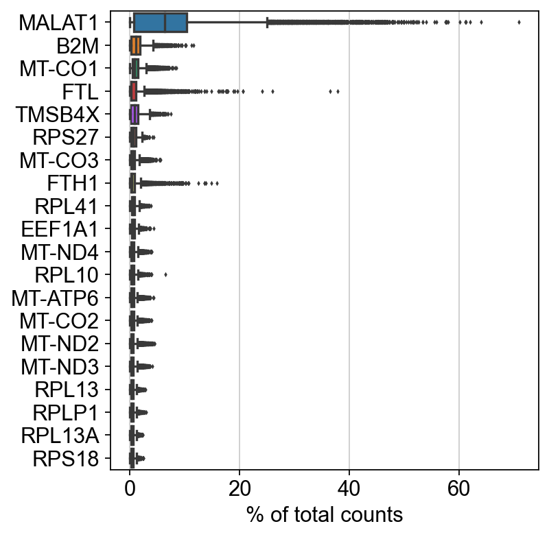
    


### Filtering and cleaning data

We follow the classic scanpy tutorial


```python
sc.pp.filter_cells(adata, min_genes=200)
sc.pp.filter_genes(adata, min_cells=3)
```

    filtered out 9107 genes that are detected in less than 3 cells


```python
adata.var['mt'] = adata.var_names.str.startswith('MT-')  # annotate the group of mitochondrial genes as 'mt'
sc.pp.calculate_qc_metrics(adata, qc_vars=['mt'], percent_top=None, log1p=False, inplace=True)
```


```python
sc.pl.violin(adata, ['n_genes_by_counts', 'total_counts', 'pct_counts_mt'],
             jitter=0.4, multi_panel=True)
```


    
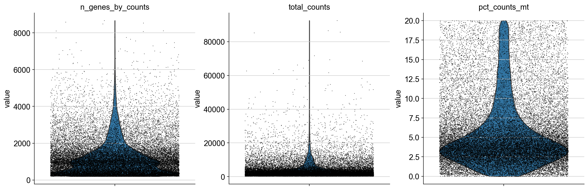
    


```python
sc.pl.scatter(adata, x='total_counts', y='pct_counts_mt')
sc.pl.scatter(adata, x='total_counts', y='n_genes_by_counts')
```


    
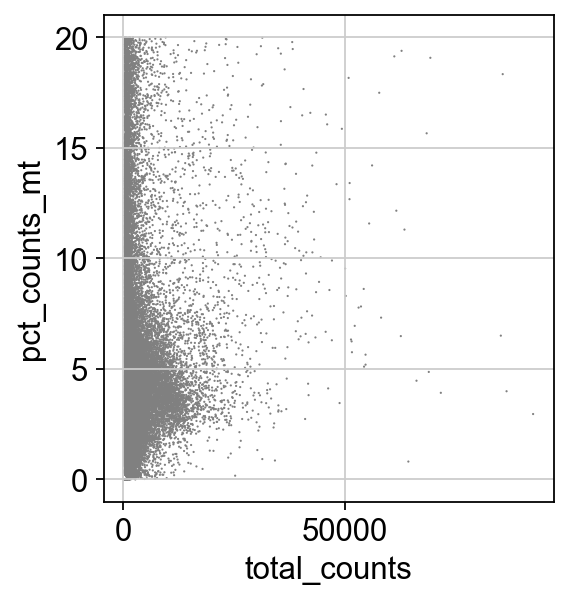
    


    
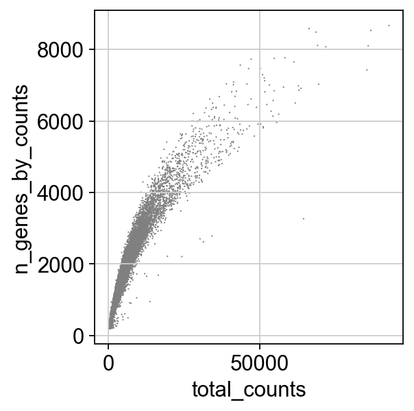
    


```python
adata = adata[adata.obs.n_genes_by_counts < 2500, :]
adata = adata[adata.obs.pct_counts_mt < 5, :]
```


```python
adata.layers['counts'] = adata.X
```


```python
sc.pp.normalize_total(adata, target_sum=1e4)
```

    normalizing counts per cell
        finished (0:00:00)


```python
sc.pp.log1p(adata)
```


```python
sc.pp.highly_variable_genes(adata, min_mean=0.0125, max_mean=3, min_disp=0.5)
```

    extracting highly variable genes
        finished (0:00:00)
    --> added
        'highly_variable', boolean vector (adata.var)
        'means', float vector (adata.var)
        'dispersions', float vector (adata.var)
        'dispersions_norm', float vector (adata.var)


```python
sc.pl.highly_variable_genes(adata)
```


    
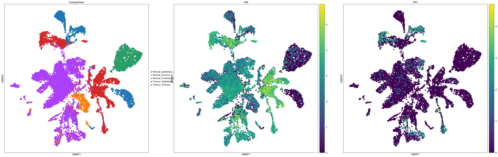
    


```python
adata.raw = adata
```


```python
adata = adata[:, adata.var.highly_variable]
```


```python
# sc.pp.regress_out(adata, ['total_counts', 'pct_counts_mt'])
```


```python
sc.pp.scale(adata, max_value=10)
```

    ... as `zero_center=True`, sparse input is densified and may lead to large memory consumption


    /Users/aureliendugourd/opt/anaconda3/envs/sc/lib/python3.9/site-packages/scanpy/preprocessing/_simple.py:843: UserWarning: Received a view of an AnnData. Making a copy.
      view_to_actual(adata)


```python
sc.tl.pca(adata, svd_solver='arpack')
```

    computing PCA
        on highly variable genes
        with n_comps=50
        finished (0:00:04)


```python
sc.pl.pca(adata, color='ASS1')
```


    
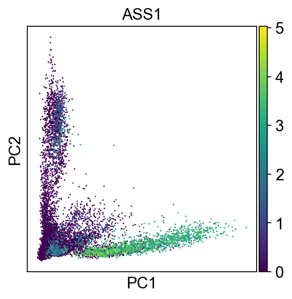
    


```python
sc.pl.pca_variance_ratio(adata, log=True)
```


    
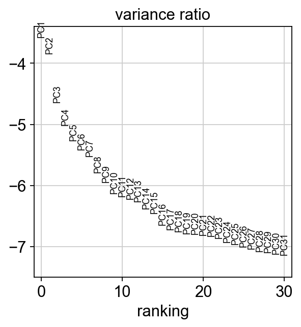
    


```python
sc.pp.neighbors(adata, n_neighbors=10, n_pcs=40)
```

    computing neighbors
        using 'X_pca' with n_pcs = 40
        finished: added to `.uns['neighbors']`
        `.obsp['distances']`, distances for each pair of neighbors
        `.obsp['connectivities']`, weighted adjacency matrix (0:00:05)


```python
sc.tl.umap(adata)
```

    computing UMAP
        finished: added
        'X_umap', UMAP coordinates (adata.obsm) (0:00:12)


### Plotting the expression of ccRCC markers as well as ASS1 in a UMAP


```python
sc.set_figure_params(figsize=(15,15))
sc.pl.umap(adata, color=['Compartment', 'ASS1','CA9'], size=200)
```


    
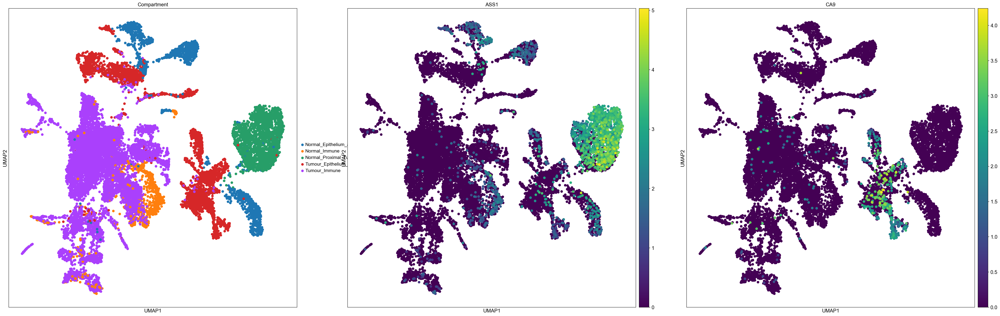
    


Normal epithelium, normal immune and normal proximal tubule cells both display homogeneous expression of ASS1 (that is, not all cell express ASS1, but many cells express it and are homogeneously spread across the cell cluster). In contrast, the vast majority of tumor immune cells do not express ASS1. More improtantly, most tumor epithelial cells do not express ASS1, except for a number of tumor cells that clearly displays its expression. This would indicate that a subset of tumor cell have normal levels of expression of ASS1. Some of them seems to be scattered in the cluster with high level of ASS1 expression, while other seems to be more closelly related and have relativelly lower level of expression of ASS1 (compared to the isolated ASS1 expressing cells of the tumor). 
On the other hand, BCAT1 expression doesn't seem to be well captured in this dataset and is mostly dropped out, as only very few cells overall seesm to show its expression (BCAT1 would be expected to at least be expressed in normal cells).  


```python
sc.pl.umap(adata, color=['Compartment','VIM','EPAS1'], size=200)
```


    
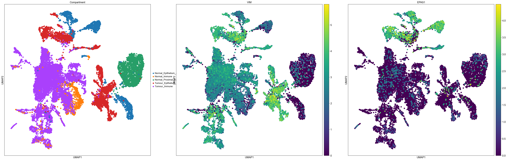
    


Tumor cells appear to express more VIM than normal cells. EPAS1 seems to be expressed in specific subsets of normal and tumor cells.


```python
sc.pl.umap(adata, color=['Compartment','SLC17A3','VCAM1'], size=200)
```


    
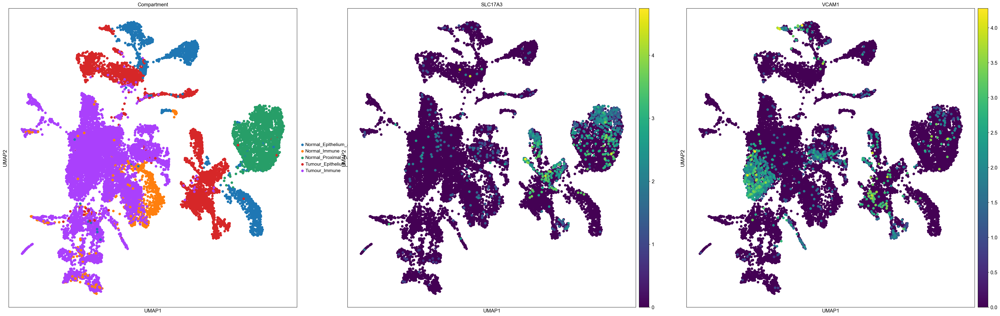
    


```python
#list(adata.obs.Source.unique())
```

### Focus on CCRCC patient 1


```python
patient = "RCC1"
adata_filtered_patient = adata[np.isin(adata.obs.Compartment, ['Normal_Epithelium_and_Vascular_without_PT','Tumour_Epithelium_and_Vascular','Normal_Proximal_Tubules','Normal_Immune','Tumour_Immune']) & [patient in i for i in list(adata.obs.Source)]].raw.to_adata()
sc.pp.highly_variable_genes(adata_filtered_patient)
adata_filtered_patient.raw = adata_filtered_patient
adata_filtered_patient = adata_filtered_patient[:, adata_filtered_patient.var.highly_variable]
sc.pp.scale(adata_filtered_patient, max_value=10)
sc.tl.pca(adata_filtered_patient, svd_solver='arpack')
sc.pp.neighbors(adata_filtered_patient, n_neighbors=10, n_pcs=40)
sc.tl.umap(adata_filtered_patient)
sc.set_figure_params(figsize=(15,15))
sc.pl.umap(adata_filtered_patient, color=['Compartment', 'ASS1','CA9'], size=200)
```

    extracting highly variable genes
        finished (0:00:00)
    --> added
        'highly_variable', boolean vector (adata.var)
        'means', float vector (adata.var)
        'dispersions', float vector (adata.var)
        'dispersions_norm', float vector (adata.var)
    ... as `zero_center=True`, sparse input is densified and may lead to large memory consumption
    computing PCA
        on highly variable genes
        with n_comps=50


    /Users/aureliendugourd/opt/anaconda3/envs/sc/lib/python3.9/site-packages/scanpy/preprocessing/_simple.py:843: UserWarning: Received a view of an AnnData. Making a copy.
      view_to_actual(adata)


        finished (0:00:03)
    computing neighbors
        using 'X_pca' with n_pcs = 40
        finished: added to `.uns['neighbors']`
        `.obsp['distances']`, distances for each pair of neighbors
        `.obsp['connectivities']`, weighted adjacency matrix (0:00:00)
    computing UMAP
        finished: added
        'X_umap', UMAP coordinates (adata.obsm) (0:00:05)


    
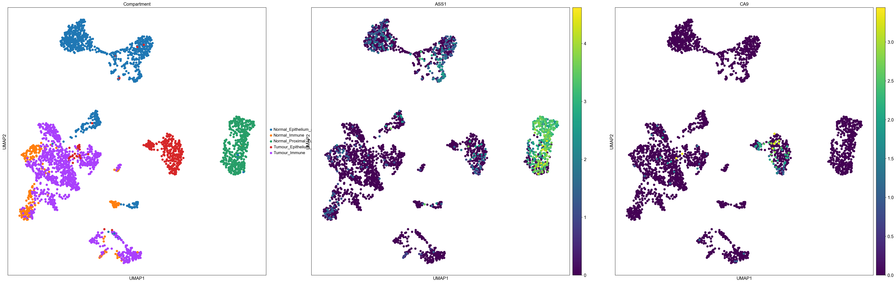
    


### Focus on CCRCC patient 2


```python
patient = "RCC2"
adata_filtered_patient = adata[np.isin(adata.obs.Compartment, ['Normal_Epithelium_and_Vascular_without_PT','Tumour_Epithelium_and_Vascular','Normal_Proximal_Tubules','Normal_Immune','Tumour_Immune']) & [patient in i for i in list(adata.obs.Source)]].raw.to_adata()
sc.pp.highly_variable_genes(adata_filtered_patient)
adata_filtered_patient.raw = adata_filtered_patient
adata_filtered_patient = adata_filtered_patient[:, adata_filtered_patient.var.highly_variable]
sc.pp.scale(adata_filtered_patient, max_value=10)
sc.tl.pca(adata_filtered_patient, svd_solver='arpack')
sc.pp.neighbors(adata_filtered_patient, n_neighbors=10, n_pcs=40)
sc.tl.umap(adata_filtered_patient)
sc.set_figure_params(figsize=(15,15))
sc.pl.umap(adata_filtered_patient, color=['Compartment', 'ASS1','CA9'], size=200, legend_loc='on data')
```

    extracting highly variable genes
        finished (0:00:00)
    --> added
        'highly_variable', boolean vector (adata.var)
        'means', float vector (adata.var)
        'dispersions', float vector (adata.var)
        'dispersions_norm', float vector (adata.var)
    ... as `zero_center=True`, sparse input is densified and may lead to large memory consumption


    /Users/aureliendugourd/opt/anaconda3/envs/sc/lib/python3.9/site-packages/scanpy/preprocessing/_simple.py:843: UserWarning: Received a view of an AnnData. Making a copy.
      view_to_actual(adata)


    computing PCA
        on highly variable genes
        with n_comps=50
        finished (0:00:03)
    computing neighbors
        using 'X_pca' with n_pcs = 40
        finished: added to `.uns['neighbors']`
        `.obsp['distances']`, distances for each pair of neighbors
        `.obsp['connectivities']`, weighted adjacency matrix (0:00:00)
    computing UMAP
        finished: added
        'X_umap', UMAP coordinates (adata.obsm) (0:00:08)


    
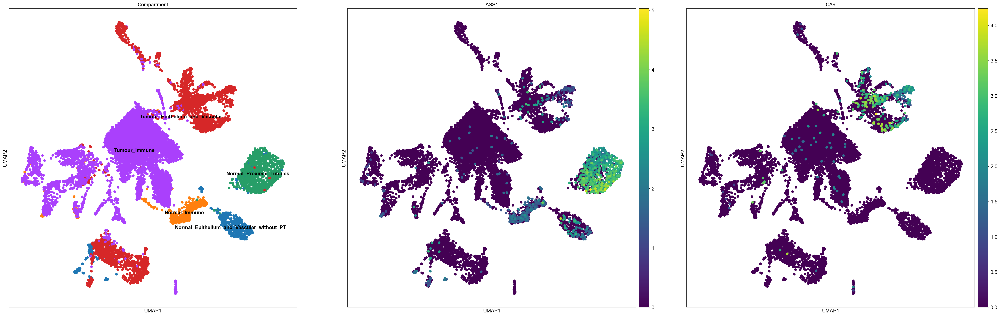
    


### Focus on CCRCC VHL patient (not many cells sadly)


```python
patient = "VHL"
adata_filtered_patient = adata[np.isin(adata.obs.Compartment, ['Normal_Epithelium_and_Vascular_without_PT','Tumour_Epithelium_and_Vascular','Normal_Proximal_Tubules','Normal_Immune','Tumour_Immune']) & [patient in i for i in list(adata.obs.Source)]].raw.to_adata()
sc.pp.highly_variable_genes(adata_filtered_patient)
adata_filtered_patient.raw = adata_filtered_patient
adata_filtered_patient = adata_filtered_patient[:, adata_filtered_patient.var.highly_variable]
sc.pp.scale(adata_filtered_patient, max_value=10)
sc.tl.pca(adata_filtered_patient, svd_solver='arpack')
sc.pp.neighbors(adata_filtered_patient, n_neighbors=10, n_pcs=40)
sc.tl.umap(adata_filtered_patient)
sc.set_figure_params(figsize=(15,15))
sc.pl.umap(adata_filtered_patient, color=['Compartment', 'ASS1','CA9'], size=200, legend_loc='on data')
```

    extracting highly variable genes
        finished (0:00:00)
    --> added
        'highly_variable', boolean vector (adata.var)
        'means', float vector (adata.var)
        'dispersions', float vector (adata.var)
        'dispersions_norm', float vector (adata.var)
    ... as `zero_center=True`, sparse input is densified and may lead to large memory consumption
    computing PCA
        on highly variable genes
        with n_comps=50


    /Users/aureliendugourd/opt/anaconda3/envs/sc/lib/python3.9/site-packages/scanpy/preprocessing/_simple.py:843: UserWarning: Received a view of an AnnData. Making a copy.
      view_to_actual(adata)


        finished (0:00:04)
    computing neighbors
        using 'X_pca' with n_pcs = 40
        finished: added to `.uns['neighbors']`
        `.obsp['distances']`, distances for each pair of neighbors
        `.obsp['connectivities']`, weighted adjacency matrix (0:00:00)
    computing UMAP
        finished: added
        'X_umap', UMAP coordinates (adata.obsm) (0:00:05)


    
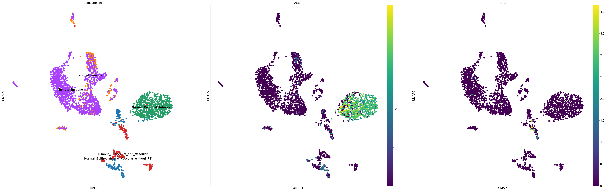
    


### Violin plot of ASS1 and EPAS1 expression in different cell types


```python
sc.pl.violin(adata, ['ASS1', 'CA9', 'BCAT1'], groupby='Compartment', size = 10)
```


    
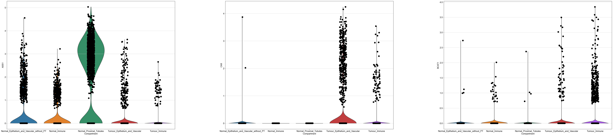
    


```python
#adata_filtered_patient_epith = adata_filtered_patient[np.isin(adata_filtered_patient.obs.Compartment, ['Normal_Epithelium_and_Vascular_without_PT','Tumour_Epithelium_and_Vascular'])].raw.to_adata()
#df = sc.get.obs_df(adata_filtered_patient_epith, ['ASS1', 'Compartment'])
#df = df.set_index('Compartment').stack().reset_index()
#df.columns = ['Compartment', 'gene', 'value']
#
#sns.violinplot(data=df, x='gene', y='value', hue="Compartment",
#                split=True, inner="quart", linewidth=1)  
#sns.stripplot(data=df, x='gene', y='value', hue="Compartment",
#                split=True)  
```


```python
#adata_filtered_patient.obs['ASS1_expressed'] = adata_filtered_patient.raw.to_adata()[:,'ASS1'].X.A >  1.5
#adata_filtered_patient.obs['ASS1_expressed'] = adata_filtered_patient.obs['ASS1_expressed'].astype(str)
```


```python
#sc.pl.umap(adata_filtered_patient, color=['Compartment', 'ASS1','ASS1_expressed'], size=100, legend_loc='on data', )
```

### Preparing data for pseudobulked differential analysis


```python
adata.obs['is_tumor'] = np.isin(adata.obs.Compartment, ['Tumour_Immune','Tumour_Epithelium_and_Vascular'])
adata.obs['is_tumor'] = adata.obs['is_tumor'].astype(str)
```


```python
adata.obs['Compartment'] = adata.obs['Compartment'].str.replace("Normal_","",regex = True)
adata.obs['Compartment'] = adata.obs['Compartment'].str.replace("Tumour_","",regex = True)
adata.obs['Compartment'] = adata.obs['Compartment'].str.replace("_without_PT","",regex = True)
```


```python
adata.obs['ASS1_expressed'] = adata.raw.to_adata()[:,'ASS1'].X.A >  1.5
adata.obs['ASS1_expressed'] = adata.obs['ASS1_expressed'].astype(str)
adata.obs['Compartment_ASS1'] = adata.obs['Compartment'].astype(str) + "_ASS1_expresed_is_" + adata.obs['ASS1_expressed'].astype(str)
```


```python
adata.obs['Compartment'].unique()
```


    array(['Epithelium_and_Vascular', 'Immune', 'Proximal_Tubules'],
          dtype=object)


```python
adata
```


    AnnData object with n_obs × n_vars = 17255 × 4712
        obs: 'barcode', 'SangerID', 'ClusterID', 'Compartment', 'nUMI', 'nGenes', 'MTfrac', 'QCpass', 'Source', 'n_genes', 'n_genes_by_counts', 'total_counts', 'total_counts_mt', 'pct_counts_mt', 'is_tumor', 'ASS1_expressed', 'Compartment_ASS1'
        var: 'gene_ids', 'n_cells', 'mt', 'n_cells_by_counts', 'mean_counts', 'pct_dropout_by_counts', 'total_counts', 'highly_variable', 'means', 'dispersions', 'dispersions_norm', 'mean', 'std'
        uns: 'log1p', 'hvg', 'pca', 'neighbors', 'umap', 'Compartment_colors'
        obsm: 'X_pca', 'X_umap'
        varm: 'PCs'
        layers: 'counts'
        obsp: 'distances', 'connectivities'


```python
adata.layers
```


    Layers with keys: counts


### Pseudobulking data


```python
padata = dc.get_pseudobulk(adata, sample_col='Source', groups_col='Compartment', layer='counts', min_prop=0.05, min_smpls=1)
```

    /Users/aureliendugourd/opt/anaconda3/envs/sc/lib/python3.9/site-packages/decoupler/utils_anndata.py:203: FutureWarning: X.dtype being converted to np.float32 from float64. In the next version of anndata (0.9) conversion will not be automatic. Pass dtype explicitly to avoid this warning. Pass `AnnData(X, dtype=X.dtype, ...)` to get the future behavour.
      psbulk = AnnData(psbulk, obs=new_obs, var=new_var)


```python
sc.pp.normalize_total(padata, target_sum=1e4)
sc.pp.log1p(padata)
padata
```

    normalizing counts per cell
        finished (0:00:00)


    /Users/aureliendugourd/opt/anaconda3/envs/sc/lib/python3.9/site-packages/scanpy/preprocessing/_normalization.py:170: UserWarning: Received a view of an AnnData. Making a copy.
      view_to_actual(adata)


    AnnData object with n_obs × n_vars = 51 × 3686
        obs: 'SangerID', 'Compartment', 'QCpass', 'Source', 'is_tumor'
        uns: 'log1p'


### Comparison between tumor and "normal" cells


```python
logFCs, pvals = dc.get_contrast(padata,
                                group_col='Compartment',
                                condition_col='is_tumor',
                                condition='True',
                                reference='False',
                                method='t-test'
                               )
logFCs
```

    ranking genes
        finished: added to `.uns['rank_genes_groups']`
        'names', sorted np.recarray to be indexed by group ids
        'scores', sorted np.recarray to be indexed by group ids
        'logfoldchanges', sorted np.recarray to be indexed by group ids
        'pvals', sorted np.recarray to be indexed by group ids
        'pvals_adj', sorted np.recarray to be indexed by group ids (0:00:00)
    ranking genes
        finished: added to `.uns['rank_genes_groups']`
        'names', sorted np.recarray to be indexed by group ids
        'scores', sorted np.recarray to be indexed by group ids
        'logfoldchanges', sorted np.recarray to be indexed by group ids
        'pvals', sorted np.recarray to be indexed by group ids
        'pvals_adj', sorted np.recarray to be indexed by group ids (0:00:00)


    Skipping group "Proximal_Tubules" since condition "True" not in column "is_tumor".


<div>
<style scoped>
    .dataframe tbody tr th:only-of-type {
        vertical-align: middle;
    }

    .dataframe tbody tr th {
        vertical-align: top;
    }

    .dataframe thead th {
        text-align: right;
    }
</style>
<table border="1" class="dataframe">
  <thead>
    <tr style="text-align: right;">
      <th></th>
      <th>AP006222.2</th>
      <th>FAM41C</th>
      <th>HES4</th>
      <th>ISG15</th>
      <th>AGRN</th>
      <th>TNFRSF18</th>
      <th>TNFRSF4</th>
      <th>FAM132A</th>
      <th>CPTP</th>
      <th>DVL1</th>
      <th>...</th>
      <th>TRPM2</th>
      <th>PTTG1IP</th>
      <th>FAM207A</th>
      <th>COL18A1</th>
      <th>COL6A1</th>
      <th>COL6A2</th>
      <th>FTCD</th>
      <th>SPATC1L</th>
      <th>S100B</th>
      <th>AC007325.4</th>
    </tr>
  </thead>
  <tbody>
    <tr>
      <th>Epithelium_and_Vascular</th>
      <td>0.813156</td>
      <td>0.0</td>
      <td>0.950026</td>
      <td>-0.160997</td>
      <td>0.770729</td>
      <td>0.0</td>
      <td>0.974819</td>
      <td>0.346723</td>
      <td>-1.020827</td>
      <td>-1.488487</td>
      <td>...</td>
      <td>0.0</td>
      <td>-0.20591</td>
      <td>0.825129</td>
      <td>0.908003</td>
      <td>-0.251999</td>
      <td>0.752014</td>
      <td>-3.463116</td>
      <td>0.0</td>
      <td>3.177897</td>
      <td>-0.47966</td>
    </tr>
    <tr>
      <th>Immune</th>
      <td>0.070864</td>
      <td>-0.423176</td>
      <td>-0.666326</td>
      <td>-0.071412</td>
      <td>0.0</td>
      <td>1.344004</td>
      <td>2.012847</td>
      <td>0.0</td>
      <td>0.155876</td>
      <td>0.0</td>
      <td>...</td>
      <td>1.024911</td>
      <td>0.111479</td>
      <td>0.414827</td>
      <td>0.813595</td>
      <td>-0.062746</td>
      <td>-0.984358</td>
      <td>-6.305344</td>
      <td>-0.197487</td>
      <td>-0.598546</td>
      <td>-0.607458</td>
    </tr>
  </tbody>
</table>
<p>2 rows × 3686 columns</p>
</div>


```python
logFCs[logFCs.columns] = logFCs[logFCs.columns].apply(pd.to_numeric)
```


```python
logFCs.values
```


    array([[ 0.81315631,  0.        ,  0.95002586, ...,  0.        ,
             3.17789674, -0.47965986],
           [ 0.07086427, -0.42317614, -0.66632563, ..., -0.19748691,
            -0.59854639, -0.60745811]])


```python
deg = dc.format_contrast_results(logFCs, pvals)
deg[deg["contrast"] == 'Epithelium_and_Vascular'].head(50)
sns.distplot(deg[deg["contrast"] == 'Epithelium_and_Vascular']["logFC"], hist=True, kde=True, 
             bins=int(500/5), color = 'darkblue', 
             hist_kws={'edgecolor':'black'},
             kde_kws={'linewidth': 4})
```

    /Users/aureliendugourd/opt/anaconda3/envs/sc/lib/python3.9/site-packages/seaborn/distributions.py:2619: FutureWarning: `distplot` is a deprecated function and will be removed in a future version. Please adapt your code to use either `displot` (a figure-level function with similar flexibility) or `histplot` (an axes-level function for histograms).
      warnings.warn(msg, FutureWarning)


    <AxesSubplot:xlabel='logFC', ylabel='Density'>


    
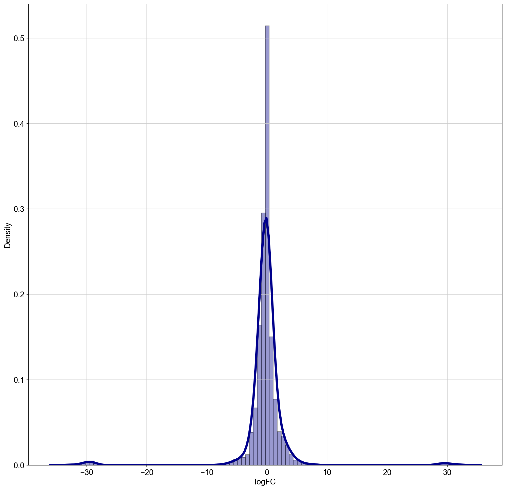
    


```python
deg = deg[deg.logFC.values < 10]
deg = deg[deg.logFC.values > -10]
deg = deg[deg.logFC.values != 0]
sns.distplot(deg[deg["contrast"] == 'Epithelium_and_Vascular']["logFC"], hist=True, kde=True, 
             bins=int(500/5), color = 'darkblue', 
             hist_kws={'edgecolor':'black'},
             kde_kws={'linewidth': 4})
```

    /Users/aureliendugourd/opt/anaconda3/envs/sc/lib/python3.9/site-packages/seaborn/distributions.py:2619: FutureWarning: `distplot` is a deprecated function and will be removed in a future version. Please adapt your code to use either `displot` (a figure-level function with similar flexibility) or `histplot` (an axes-level function for histograms).
      warnings.warn(msg, FutureWarning)


    <AxesSubplot:xlabel='logFC', ylabel='Density'>


    
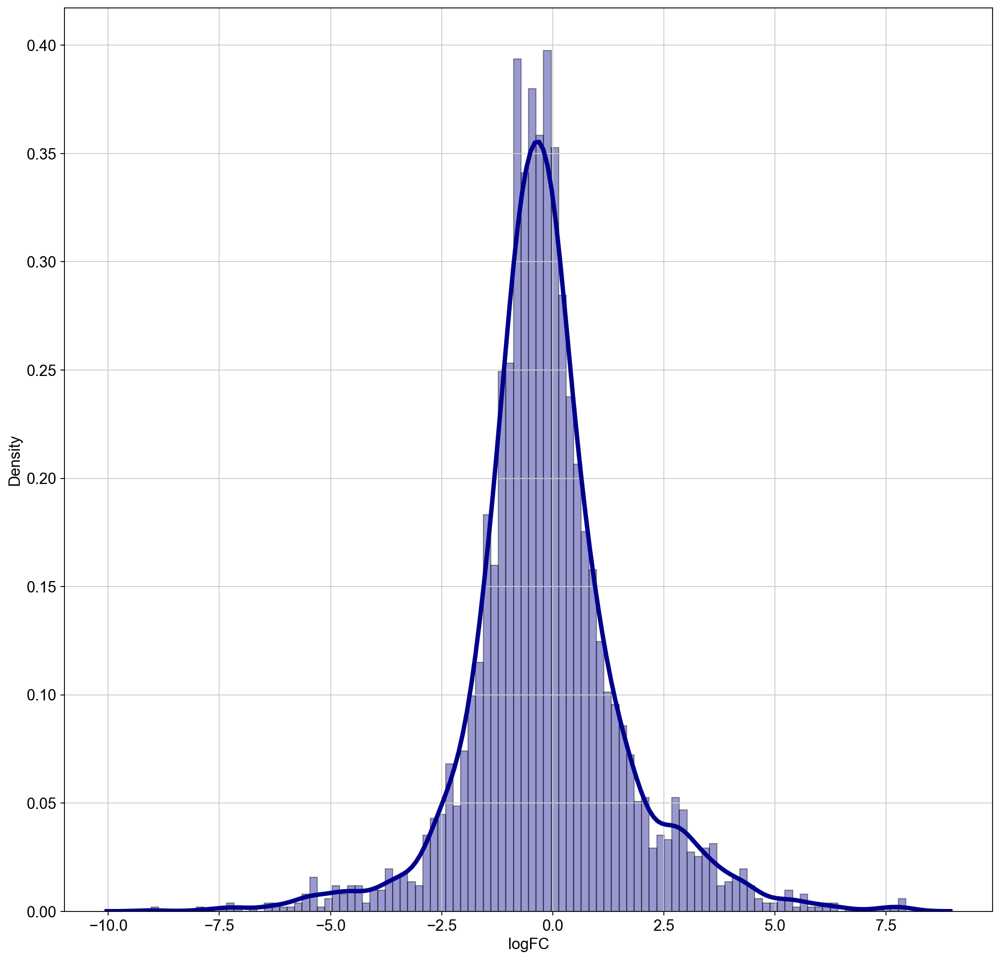
    


```python
deg[deg["name"] == "ASS1"]
```


<div>
<style scoped>
    .dataframe tbody tr th:only-of-type {
        vertical-align: middle;
    }

    .dataframe tbody tr th {
        vertical-align: top;
    }

    .dataframe thead th {
        text-align: right;
    }
</style>
<table border="1" class="dataframe">
  <thead>
    <tr style="text-align: right;">
      <th></th>
      <th>contrast</th>
      <th>name</th>
      <th>logFC</th>
      <th>pval</th>
    </tr>
  </thead>
  <tbody>
    <tr>
      <th>40</th>
      <td>Epithelium_and_Vascular</td>
      <td>ASS1</td>
      <td>-1.979514</td>
      <td>0.000013</td>
    </tr>
    <tr>
      <th>48</th>
      <td>Immune</td>
      <td>ASS1</td>
      <td>-4.687952</td>
      <td>0.000016</td>
    </tr>
  </tbody>
</table>
</div>


```python
deg[deg["name"] == "BCAT1"]
```


<div>
<style scoped>
    .dataframe tbody tr th:only-of-type {
        vertical-align: middle;
    }

    .dataframe tbody tr th {
        vertical-align: top;
    }

    .dataframe thead th {
        text-align: right;
    }
</style>
<table border="1" class="dataframe">
  <thead>
    <tr style="text-align: right;">
      <th></th>
      <th>contrast</th>
      <th>name</th>
      <th>logFC</th>
      <th>pval</th>
    </tr>
  </thead>
  <tbody>
    <tr>
      <th>783</th>
      <td>Epithelium_and_Vascular</td>
      <td>BCAT1</td>
      <td>3.104620</td>
      <td>0.010795</td>
    </tr>
    <tr>
      <th>1384</th>
      <td>Immune</td>
      <td>BCAT1</td>
      <td>1.317121</td>
      <td>0.044577</td>
    </tr>
  </tbody>
</table>
</div>


```python
deg[deg["name"] == "GLUL"]
```


<div>
<style scoped>
    .dataframe tbody tr th:only-of-type {
        vertical-align: middle;
    }

    .dataframe tbody tr th {
        vertical-align: top;
    }

    .dataframe thead th {
        text-align: right;
    }
</style>
<table border="1" class="dataframe">
  <thead>
    <tr style="text-align: right;">
      <th></th>
      <th>contrast</th>
      <th>name</th>
      <th>logFC</th>
      <th>pval</th>
    </tr>
  </thead>
  <tbody>
    <tr>
      <th>425</th>
      <td>Epithelium_and_Vascular</td>
      <td>GLUL</td>
      <td>-1.099327</td>
      <td>0.002715</td>
    </tr>
    <tr>
      <th>5089</th>
      <td>Immune</td>
      <td>GLUL</td>
      <td>-0.031392</td>
      <td>0.918313</td>
    </tr>
  </tbody>
</table>
</div>


### Progeny anaylsis of tumor vs "normal"


```python
# Retrieve PROGENy model weights
progeny = dc.get_progeny(top=300)

# Infer pathway activities with mlm
pathway_acts, pathway_pvals = dc.run_mlm(mat=logFCs, net=progeny, source='source', target='target', weight='weight', )
pathway_acts
```


<div>
<style scoped>
    .dataframe tbody tr th:only-of-type {
        vertical-align: middle;
    }

    .dataframe tbody tr th {
        vertical-align: top;
    }

    .dataframe thead th {
        text-align: right;
    }
</style>
<table border="1" class="dataframe">
  <thead>
    <tr style="text-align: right;">
      <th></th>
      <th>Androgen</th>
      <th>EGFR</th>
      <th>Estrogen</th>
      <th>Hypoxia</th>
      <th>JAK-STAT</th>
      <th>MAPK</th>
      <th>NFkB</th>
      <th>PI3K</th>
      <th>TGFb</th>
      <th>TNFa</th>
      <th>Trail</th>
      <th>VEGF</th>
      <th>WNT</th>
      <th>p53</th>
    </tr>
  </thead>
  <tbody>
    <tr>
      <th>Epithelium_and_Vascular</th>
      <td>-0.622776</td>
      <td>0.023126</td>
      <td>0.533816</td>
      <td>3.324568</td>
      <td>0.388519</td>
      <td>0.072155</td>
      <td>0.213303</td>
      <td>-0.376993</td>
      <td>0.744033</td>
      <td>0.008566</td>
      <td>-2.823359</td>
      <td>0.198478</td>
      <td>0.612139</td>
      <td>0.365630</td>
    </tr>
    <tr>
      <th>Immune</th>
      <td>-0.245061</td>
      <td>-0.093172</td>
      <td>-0.376814</td>
      <td>3.654325</td>
      <td>1.504736</td>
      <td>-0.168990</td>
      <td>-0.232595</td>
      <td>0.150864</td>
      <td>1.954179</td>
      <td>0.422688</td>
      <td>-1.256402</td>
      <td>-0.597414</td>
      <td>0.497345</td>
      <td>-1.385351</td>
    </tr>
  </tbody>
</table>
</div>


```python
progeny
```


<div>
<style scoped>
    .dataframe tbody tr th:only-of-type {
        vertical-align: middle;
    }

    .dataframe tbody tr th {
        vertical-align: top;
    }

    .dataframe thead th {
        text-align: right;
    }
</style>
<table border="1" class="dataframe">
  <thead>
    <tr style="text-align: right;">
      <th></th>
      <th>source</th>
      <th>target</th>
      <th>weight</th>
      <th>p_value</th>
    </tr>
  </thead>
  <tbody>
    <tr>
      <th>0</th>
      <td>Androgen</td>
      <td>TMPRSS2</td>
      <td>11.490631</td>
      <td>0.000000e+00</td>
    </tr>
    <tr>
      <th>1</th>
      <td>Androgen</td>
      <td>NKX3-1</td>
      <td>10.622551</td>
      <td>2.242078e-44</td>
    </tr>
    <tr>
      <th>2</th>
      <td>Androgen</td>
      <td>MBOAT2</td>
      <td>10.472733</td>
      <td>4.624285e-44</td>
    </tr>
    <tr>
      <th>3</th>
      <td>Androgen</td>
      <td>KLK2</td>
      <td>10.176186</td>
      <td>1.944414e-40</td>
    </tr>
    <tr>
      <th>4</th>
      <td>Androgen</td>
      <td>SARG</td>
      <td>11.386852</td>
      <td>2.790209e-40</td>
    </tr>
    <tr>
      <th>...</th>
      <td>...</td>
      <td>...</td>
      <td>...</td>
      <td>...</td>
    </tr>
    <tr>
      <th>4195</th>
      <td>p53</td>
      <td>F5</td>
      <td>2.397854</td>
      <td>5.746843e-08</td>
    </tr>
    <tr>
      <th>4196</th>
      <td>p53</td>
      <td>MKI67</td>
      <td>-5.680340</td>
      <td>5.758565e-08</td>
    </tr>
    <tr>
      <th>4197</th>
      <td>p53</td>
      <td>THOC2</td>
      <td>-2.108178</td>
      <td>5.858359e-08</td>
    </tr>
    <tr>
      <th>4198</th>
      <td>p53</td>
      <td>POLA1</td>
      <td>-4.943873</td>
      <td>5.911873e-08</td>
    </tr>
    <tr>
      <th>4199</th>
      <td>p53</td>
      <td>TMEM52</td>
      <td>2.596648</td>
      <td>6.576950e-08</td>
    </tr>
  </tbody>
</table>
<p>4200 rows × 4 columns</p>
</div>


### TF activity analysis of tumor vs "normal"


```python
# Retrieve DoRothEA gene regulatory network
dorothea = dc.get_dorothea()

# Infer pathway activities with mlm
tf_acts, tf_pvals = dc.run_mlm(mat=logFCs, net=dorothea, source='source', target='target', weight='weight')
tf_acts
```


<div>
<style scoped>
    .dataframe tbody tr th:only-of-type {
        vertical-align: middle;
    }

    .dataframe tbody tr th {
        vertical-align: top;
    }

    .dataframe thead th {
        text-align: right;
    }
</style>
<table border="1" class="dataframe">
  <thead>
    <tr style="text-align: right;">
      <th></th>
      <th>AHR</th>
      <th>AR</th>
      <th>ARNT</th>
      <th>ASCL1</th>
      <th>ATF1</th>
      <th>ATF2</th>
      <th>ATF3</th>
      <th>ATF4</th>
      <th>ATF7</th>
      <th>BACH1</th>
      <th>...</th>
      <th>YY1</th>
      <th>ZBTB7A</th>
      <th>ZEB1</th>
      <th>ZEB2</th>
      <th>ZFX</th>
      <th>ZKSCAN1</th>
      <th>ZNF143</th>
      <th>ZNF24</th>
      <th>ZNF263</th>
      <th>ZNF384</th>
    </tr>
  </thead>
  <tbody>
    <tr>
      <th>Epithelium_and_Vascular</th>
      <td>-0.528930</td>
      <td>0.440498</td>
      <td>1.202645</td>
      <td>0.098777</td>
      <td>0.636739</td>
      <td>-0.026554</td>
      <td>0.524343</td>
      <td>1.338917</td>
      <td>-0.197054</td>
      <td>-0.823449</td>
      <td>...</td>
      <td>0.625156</td>
      <td>-0.765785</td>
      <td>-0.269299</td>
      <td>0.169720</td>
      <td>-0.058416</td>
      <td>0.633418</td>
      <td>-0.587634</td>
      <td>0.402045</td>
      <td>0.579383</td>
      <td>-0.616718</td>
    </tr>
    <tr>
      <th>Immune</th>
      <td>-0.188516</td>
      <td>-0.302787</td>
      <td>-0.201573</td>
      <td>-0.464812</td>
      <td>1.201231</td>
      <td>0.381235</td>
      <td>-0.880227</td>
      <td>-0.062096</td>
      <td>-0.033954</td>
      <td>-0.413839</td>
      <td>...</td>
      <td>-0.267652</td>
      <td>-0.342222</td>
      <td>0.818472</td>
      <td>0.274058</td>
      <td>-0.321672</td>
      <td>0.630000</td>
      <td>-0.567394</td>
      <td>0.338063</td>
      <td>-0.224621</td>
      <td>0.463316</td>
    </tr>
  </tbody>
</table>
<p>2 rows × 220 columns</p>
</div>


### Preparing pseudobulk of ASS1 expressing cancer cells


```python
padata_ASS1 = dc.get_pseudobulk(adata, sample_col='Source', groups_col='Compartment_ASS1', layer='counts', min_prop=0.05, min_smpls=1)
sc.pp.normalize_total(padata_ASS1, target_sum=1e4)
sc.pp.log1p(padata_ASS1)
padata_ASS1
```

    normalizing counts per cell
        finished (0:00:00)


    /Users/aureliendugourd/opt/anaconda3/envs/sc/lib/python3.9/site-packages/decoupler/utils_anndata.py:203: FutureWarning: X.dtype being converted to np.float32 from float64. In the next version of anndata (0.9) conversion will not be automatic. Pass dtype explicitly to avoid this warning. Pass `AnnData(X, dtype=X.dtype, ...)` to get the future behavour.
      psbulk = AnnData(psbulk, obs=new_obs, var=new_var)
    /Users/aureliendugourd/opt/anaconda3/envs/sc/lib/python3.9/site-packages/scanpy/preprocessing/_normalization.py:170: UserWarning: Received a view of an AnnData. Making a copy.
      view_to_actual(adata)


    AnnData object with n_obs × n_vars = 72 × 4163
        obs: 'SangerID', 'Compartment', 'QCpass', 'Source', 'is_tumor', 'ASS1_expressed', 'Compartment_ASS1'
        uns: 'log1p'


```python
padata_ASS1.obs.Compartment_ASS1.unique()
```


    array(['Epithelium_and_Vascular_ASS1_expresed_is_False',
           'Epithelium_and_Vascular_ASS1_expresed_is_True',
           'Immune_ASS1_expresed_is_False', 'Immune_ASS1_expresed_is_True',
           'Proximal_Tubules_ASS1_expresed_is_False',
           'Proximal_Tubules_ASS1_expresed_is_True'], dtype=object)


### Differential anylsis between ASS1 cancer cells and other cancer cells


```python
logFCs, pvals = dc.get_contrast(padata_ASS1,
                                group_col='is_tumor',
                                condition_col='Compartment_ASS1',
                                condition='Epithelium_and_Vascular_ASS1_expresed_is_True',
                                reference='Epithelium_and_Vascular_ASS1_expresed_is_False',
                                method='t-test'
                               )
logFCs
```

    ranking genes
        finished: added to `.uns['rank_genes_groups']`
        'names', sorted np.recarray to be indexed by group ids
        'scores', sorted np.recarray to be indexed by group ids
        'logfoldchanges', sorted np.recarray to be indexed by group ids
        'pvals', sorted np.recarray to be indexed by group ids
        'pvals_adj', sorted np.recarray to be indexed by group ids (0:00:00)
    ranking genes
        finished: added to `.uns['rank_genes_groups']`
        'names', sorted np.recarray to be indexed by group ids
        'scores', sorted np.recarray to be indexed by group ids
        'logfoldchanges', sorted np.recarray to be indexed by group ids
        'pvals', sorted np.recarray to be indexed by group ids
        'pvals_adj', sorted np.recarray to be indexed by group ids (0:00:00)


<div>
<style scoped>
    .dataframe tbody tr th:only-of-type {
        vertical-align: middle;
    }

    .dataframe tbody tr th {
        vertical-align: top;
    }

    .dataframe thead th {
        text-align: right;
    }
</style>
<table border="1" class="dataframe">
  <thead>
    <tr style="text-align: right;">
      <th></th>
      <th>AP006222.2</th>
      <th>FAM41C</th>
      <th>HES4</th>
      <th>ISG15</th>
      <th>AGRN</th>
      <th>TNFRSF18</th>
      <th>TNFRSF4</th>
      <th>FAM132A</th>
      <th>CPTP</th>
      <th>DVL1</th>
      <th>...</th>
      <th>PTTG1IP</th>
      <th>FAM207A</th>
      <th>COL18A1</th>
      <th>COL6A1</th>
      <th>COL6A2</th>
      <th>FTCD</th>
      <th>SPATC1L</th>
      <th>S100B</th>
      <th>AC011043.1</th>
      <th>AC007325.4</th>
    </tr>
  </thead>
  <tbody>
    <tr>
      <th>False</th>
      <td>0.615263</td>
      <td>0.0</td>
      <td>-30.262264</td>
      <td>-1.13903</td>
      <td>0.014374</td>
      <td>0.0</td>
      <td>-29.888121</td>
      <td>-28.413111</td>
      <td>0.153789</td>
      <td>-28.98934</td>
      <td>...</td>
      <td>-0.032598</td>
      <td>-0.471703</td>
      <td>-0.578688</td>
      <td>-0.145025</td>
      <td>-30.25934</td>
      <td>1.537863</td>
      <td>0.0</td>
      <td>-23.651663</td>
      <td>29.269009</td>
      <td>0.520121</td>
    </tr>
    <tr>
      <th>True</th>
      <td>-0.061539</td>
      <td>0.0</td>
      <td>-31.291611</td>
      <td>-0.973183</td>
      <td>-30.407473</td>
      <td>29.103266</td>
      <td>-30.937588</td>
      <td>-28.761116</td>
      <td>0.278546</td>
      <td>-27.343489</td>
      <td>...</td>
      <td>0.292476</td>
      <td>0.550223</td>
      <td>-2.802676</td>
      <td>-0.532447</td>
      <td>-30.960546</td>
      <td>-26.412716</td>
      <td>0.0</td>
      <td>-26.612715</td>
      <td>28.659264</td>
      <td>1.403195</td>
    </tr>
  </tbody>
</table>
<p>2 rows × 4163 columns</p>
</div>


```python
logFCs[logFCs.columns] = logFCs[logFCs.columns].apply(pd.to_numeric)
```


```python
deg_ASS1 = dc.format_contrast_results(logFCs, pvals)
deg_ASS1[deg_ASS1["contrast"] == 'True'].head(50)
sns.distplot(deg_ASS1[deg_ASS1["contrast"] == 'True']["logFC"], hist=True, kde=True, 
             bins=int(500/5), color = 'darkblue', 
             hist_kws={'edgecolor':'black'},
             kde_kws={'linewidth': 4})
```

    /Users/aureliendugourd/opt/anaconda3/envs/sc/lib/python3.9/site-packages/seaborn/distributions.py:2619: FutureWarning: `distplot` is a deprecated function and will be removed in a future version. Please adapt your code to use either `displot` (a figure-level function with similar flexibility) or `histplot` (an axes-level function for histograms).
      warnings.warn(msg, FutureWarning)


    <AxesSubplot:xlabel='logFC', ylabel='Density'>


    
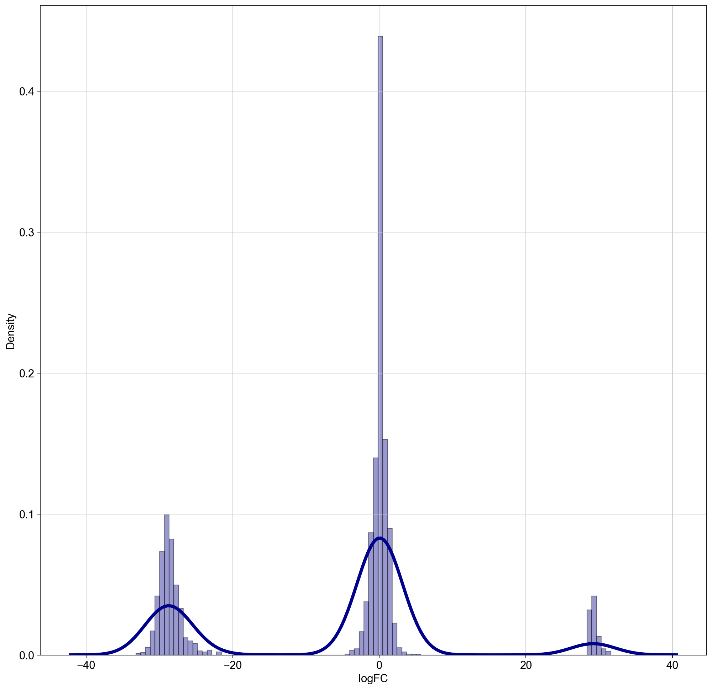
    


```python
deg_ASS1 = deg_ASS1[deg_ASS1.logFC.values < 10]
deg_ASS1 = deg_ASS1[deg_ASS1.logFC.values > -10]
deg_ASS1 = deg_ASS1[deg_ASS1.logFC.values != 0]
sns.distplot(deg_ASS1[deg_ASS1["contrast"] == 'True']["logFC"], hist=True, kde=True, 
             bins=int(500/5), color = 'darkblue', 
             hist_kws={'edgecolor':'black'},
             kde_kws={'linewidth': 4})
```

    /Users/aureliendugourd/opt/anaconda3/envs/sc/lib/python3.9/site-packages/seaborn/distributions.py:2619: FutureWarning: `distplot` is a deprecated function and will be removed in a future version. Please adapt your code to use either `displot` (a figure-level function with similar flexibility) or `histplot` (an axes-level function for histograms).
      warnings.warn(msg, FutureWarning)


    <AxesSubplot:xlabel='logFC', ylabel='Density'>


    
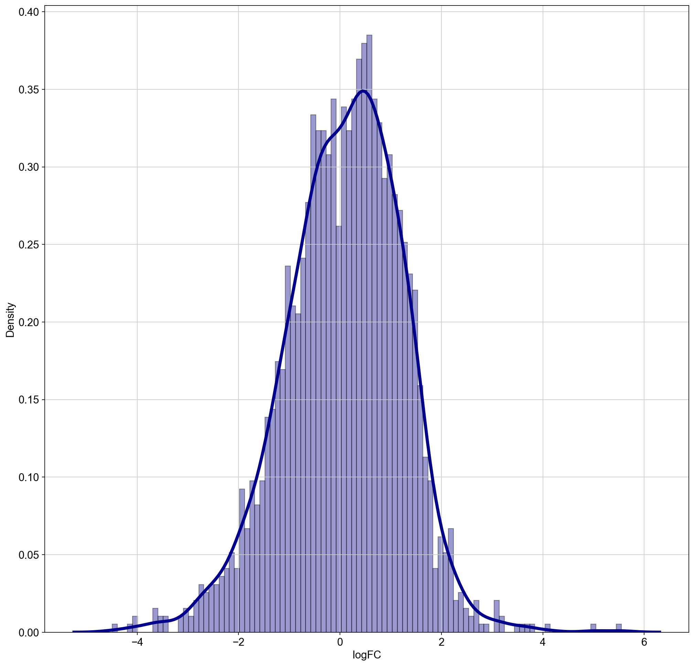
    


```python
# Retrieve PROGENy model weights
progeny = dc.get_progeny(top=300)

# Infer pathway activities with mlm
pathway_acts, pathway_pvals = dc.run_mlm(mat=logFCs, net=progeny, source='source', target='target', weight='weight', )
pathway_acts
```


<div>
<style scoped>
    .dataframe tbody tr th:only-of-type {
        vertical-align: middle;
    }

    .dataframe tbody tr th {
        vertical-align: top;
    }

    .dataframe thead th {
        text-align: right;
    }
</style>
<table border="1" class="dataframe">
  <thead>
    <tr style="text-align: right;">
      <th></th>
      <th>Androgen</th>
      <th>EGFR</th>
      <th>Estrogen</th>
      <th>Hypoxia</th>
      <th>JAK-STAT</th>
      <th>MAPK</th>
      <th>NFkB</th>
      <th>PI3K</th>
      <th>TGFb</th>
      <th>TNFa</th>
      <th>Trail</th>
      <th>VEGF</th>
      <th>WNT</th>
      <th>p53</th>
    </tr>
  </thead>
  <tbody>
    <tr>
      <th>False</th>
      <td>-1.131816</td>
      <td>-2.495776</td>
      <td>0.742138</td>
      <td>-1.014588</td>
      <td>-0.393204</td>
      <td>0.496855</td>
      <td>-1.383344</td>
      <td>-0.105985</td>
      <td>-0.917007</td>
      <td>-0.214661</td>
      <td>0.712755</td>
      <td>-0.094329</td>
      <td>-0.302594</td>
      <td>-1.307871</td>
    </tr>
    <tr>
      <th>True</th>
      <td>-1.903295</td>
      <td>-2.047513</td>
      <td>-1.615937</td>
      <td>3.035408</td>
      <td>0.536857</td>
      <td>0.679014</td>
      <td>0.551072</td>
      <td>-1.260037</td>
      <td>-0.841598</td>
      <td>-0.788575</td>
      <td>0.929772</td>
      <td>-0.710999</td>
      <td>-0.768446</td>
      <td>0.325159</td>
    </tr>
  </tbody>
</table>
</div>


```python
deg.to_csv(path_or_buf='../results/DA_tumorVsHealthy.csv')
```


```python
deg_ASS1.to_csv(path_or_buf='../results/DA_ASS1vsNoASS1.csv')
```


```python

```
