```python
import numpy as np
import pandas as pd
import scanpy as sc
import decoupler as dc
```


```python
sc.settings.verbosity = 3             # verbosity: errors (0), warnings (1), info (2), hints (3)
sc.logging.print_header()
sc.settings.set_figure_params(dpi=80, facecolor='white')
```

    scanpy==1.9.1 anndata==0.8.0 umap==0.5.3 numpy==1.21.6 scipy==1.8.0 pandas==1.4.2 scikit-learn==1.0.2 statsmodels==0.13.2 python-igraph==0.9.10 pynndescent==0.5.6


```python
results_file = 'write/pbmc3k.h5ad'  # the file that will store the analysis results
```

Data was downloaded from https://www.science.org/doi/10.1126/science.aat1699


```python
adata = sc.read_10x_mtx(
    '../data/aat1699_DataS1/',  # the directory with the `.mtx` file
    var_names='gene_symbols',   # use gene symbols for the variable names (variables-axis index)
    cache=True)                 # write a cache file for faster subsequent reading
```

    ... reading from cache file cache/..-data-aat1699_DataS1-matrix.h5ad


```python
adata.var_names_make_unique()  # this is u'nnecessary if using `var_names='gene_ids'` in `sc.read_10x_mtx`
```


```python
adata
```


    AnnData object with n_obs × n_vars = 125139 × 33694
        var: 'gene_ids'


```python
meta = pd.read_csv('../support/cell_annotations.csv', sep=";").set_index('DropletID')
meta = meta.loc[adata.obs.index.intersection(meta.index)]
meta.Compartment.unique()
adata.obs = adata.obs.merge(meta, left_index=True, right_index=True)
```


```python
adata = adata[np.isin(adata.obs.Compartment, ['Normal_Epithelium_and_Vascular_without_PT','Tumour_Epithelium_and_Vascular','Normal_Proximal_Tubules','Normal_Immune','Tumour_Immune']) & (np.array(["RCC1" in i for i in list(adata.obs.Source)]) | np.array(["RCC2" in i for i in list(adata.obs.Source)]))]
```


```python
sc.pl.highest_expr_genes(adata, n_top=20, )
```

    normalizing counts per cell


    /Users/aureliendugourd/opt/anaconda3/envs/sc/lib/python3.9/site-packages/scanpy/preprocessing/_normalization.py:170: UserWarning: Received a view of an AnnData. Making a copy.
      view_to_actual(adata)


        finished (0:00:00)


    
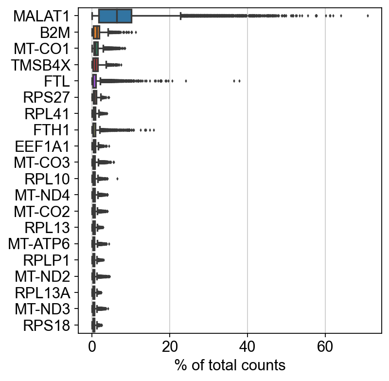
    


```python
sc.pp.filter_cells(adata, min_genes=200)
sc.pp.filter_genes(adata, min_cells=3)
```

    filtered out 9488 genes that are detected in less than 3 cells


```python
adata.var['mt'] = adata.var_names.str.startswith('MT-')  # annotate the group of mitochondrial genes as 'mt'
sc.pp.calculate_qc_metrics(adata, qc_vars=['mt'], percent_top=None, log1p=False, inplace=True)
```


```python
sc.pl.violin(adata, ['n_genes_by_counts', 'total_counts', 'pct_counts_mt'],
             jitter=0.4, multi_panel=True)
```


    
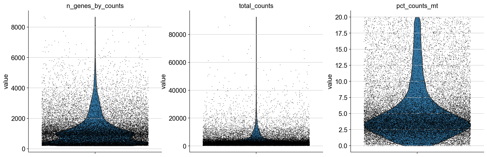
    


```python
sc.pl.scatter(adata, x='total_counts', y='pct_counts_mt')
sc.pl.scatter(adata, x='total_counts', y='n_genes_by_counts')
```


    
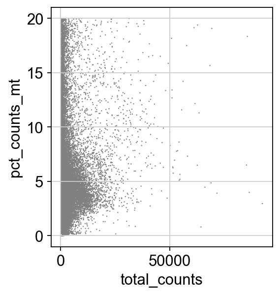
    


    

    


```python
adata = adata[adata.obs.n_genes_by_counts < 2500, :]
adata = adata[adata.obs.pct_counts_mt < 5, :]
```


```python
adata.layers['counts'] = adata.X
```


```python
sc.pp.normalize_total(adata, target_sum=1e4)
```

    normalizing counts per cell
        finished (0:00:00)


```python
sc.pp.log1p(adata)
```


```python
sc.pp.highly_variable_genes(adata, min_mean=0.0125, max_mean=3, min_disp=0.5)
```

    extracting highly variable genes
        finished (0:00:00)
    --> added
        'highly_variable', boolean vector (adata.var)
        'means', float vector (adata.var)
        'dispersions', float vector (adata.var)
        'dispersions_norm', float vector (adata.var)


```python
sc.pl.highly_variable_genes(adata)
```


    
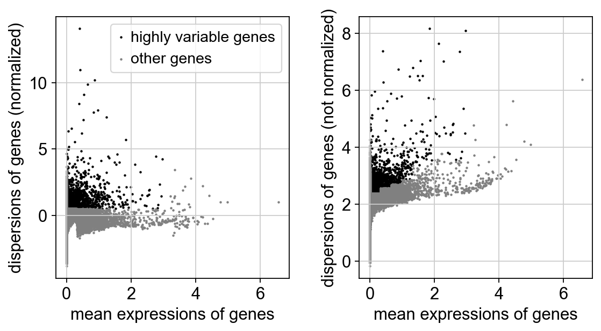
    


```python
adata.raw = adata
```


```python
adata = adata[:, adata.var.highly_variable]
```


```python
# sc.pp.regress_out(adata, ['total_counts', 'pct_counts_mt'])
```


```python
sc.pp.scale(adata, max_value=10)
```

    /Users/aureliendugourd/opt/anaconda3/envs/sc/lib/python3.9/site-packages/scanpy/preprocessing/_simple.py:843: UserWarning: Received a view of an AnnData. Making a copy.
      view_to_actual(adata)


    ... as `zero_center=True`, sparse input is densified and may lead to large memory consumption


```python
sc.tl.pca(adata, svd_solver='arpack')
```

    computing PCA
        on highly variable genes
        with n_comps=50
        finished (0:00:03)


```python
sc.pl.pca(adata, color='ASS1')
```


    
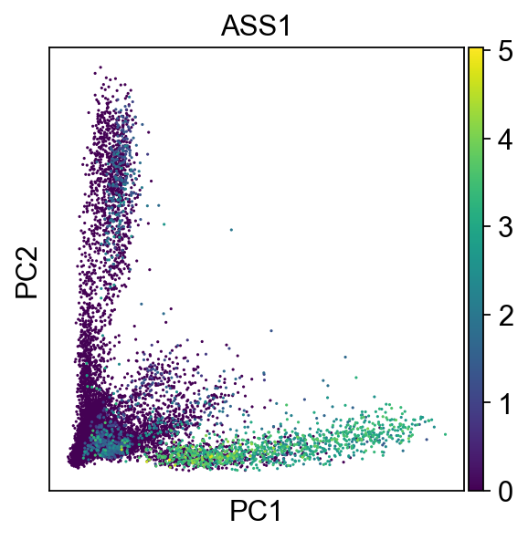
    


```python
sc.pl.pca_variance_ratio(adata, log=True)
```


    
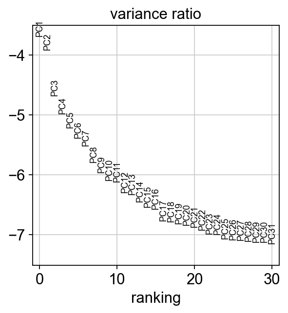
    


```python
sc.pp.neighbors(adata, n_neighbors=10, n_pcs=40)
```

    computing neighbors
        using 'X_pca' with n_pcs = 40
        finished: added to `.uns['neighbors']`
        `.obsp['distances']`, distances for each pair of neighbors
        `.obsp['connectivities']`, weighted adjacency matrix (0:00:06)


```python
sc.tl.umap(adata)
```

    computing UMAP
        finished: added
        'X_umap', UMAP coordinates (adata.obsm) (0:00:10)


```python
sc.set_figure_params(figsize=(15,15))
sc.pl.umap(adata, color=['Compartment', 'ASS1','BCAT1'], size=200)
```


    
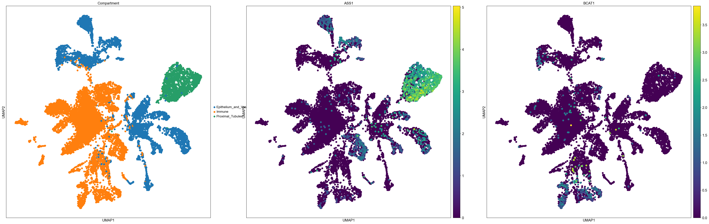
    


```python
sc.pl.umap(adata, color=['Compartment','VIM','EPAS1'], size=200)
```


    

    


```python
list(adata.obs.Source.unique())
```


    ['RCC2_Kid_N_ldc_1_1',
     'RCC2_Kid_N_ldc_1_2',
     'RCC2_Kid_N_ldc_1_3',
     'RCC2_Kid_T_ldc_1_1',
     'RCC2_Kid_T_ldc_1_2',
     'RCC2_Kid_T_ldc_2_1',
     'RCC2_Kid_T_ldc_2_2',
     'RCC1_Kid_N_ldc_1_1',
     'RCC1_Kid_N_ldc_1_2',
     'RCC1_Kid_N_ldc_2_1',
     'RCC1_Kid_T_ldc_1_1',
     'RCC1_Kid_T_ldc_1_2',
     'RCC1_Kid_T_ldc_2_1',
     'RCC1_Kid_T_ldc_2_2',
     'RCC1_Ure_N_ldc_1_1']


```python
patient = "RCC1"
adata_filtered_patient = adata[np.isin(adata.obs.Compartment, ['Normal_Epithelium_and_Vascular_without_PT','Tumour_Epithelium_and_Vascular','Normal_Proximal_Tubules','Normal_Immune','Tumour_Immune']) & [patient in i for i in list(adata.obs.Source)]].raw.to_adata()
sc.pp.highly_variable_genes(adata_filtered_patient)
adata_filtered_patient.raw = adata_filtered_patient
adata_filtered_patient = adata_filtered_patient[:, adata_filtered_patient.var.highly_variable]
sc.pp.scale(adata_filtered_patient, max_value=10)
sc.tl.pca(adata_filtered_patient, svd_solver='arpack')
sc.pp.neighbors(adata_filtered_patient, n_neighbors=10, n_pcs=40)
sc.tl.umap(adata_filtered_patient)
sc.set_figure_params(figsize=(15,15))
sc.pl.umap(adata_filtered_patient, color=['Compartment', 'ASS1','EPAS1'], size=200)
```

    extracting highly variable genes
        finished (0:00:00)
    --> added
        'highly_variable', boolean vector (adata.var)
        'means', float vector (adata.var)
        'dispersions', float vector (adata.var)
        'dispersions_norm', float vector (adata.var)
    ... as `zero_center=True`, sparse input is densified and may lead to large memory consumption
    computing PCA
        on highly variable genes
        with n_comps=50


    /Users/aureliendugourd/opt/anaconda3/envs/sc/lib/python3.9/site-packages/scanpy/preprocessing/_simple.py:843: UserWarning: Received a view of an AnnData. Making a copy.
      view_to_actual(adata)


        finished (0:00:01)
    computing neighbors
        using 'X_pca' with n_pcs = 40
        finished: added to `.uns['neighbors']`
        `.obsp['distances']`, distances for each pair of neighbors
        `.obsp['connectivities']`, weighted adjacency matrix (0:00:00)
    computing UMAP
        finished: added
        'X_umap', UMAP coordinates (adata.obsm) (0:00:05)


    
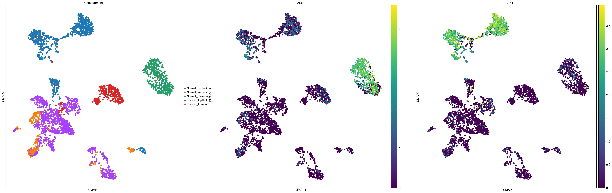
    


```python
patient = "RCC2"
adata_filtered_patient = adata[np.isin(adata.obs.Compartment, ['Normal_Epithelium_and_Vascular_without_PT','Tumour_Epithelium_and_Vascular','Normal_Proximal_Tubules','Normal_Immune','Tumour_Immune']) & [patient in i for i in list(adata.obs.Source)]].raw.to_adata()
sc.pp.highly_variable_genes(adata_filtered_patient)
adata_filtered_patient.raw = adata_filtered_patient
adata_filtered_patient = adata_filtered_patient[:, adata_filtered_patient.var.highly_variable]
sc.pp.scale(adata_filtered_patient, max_value=10)
sc.tl.pca(adata_filtered_patient, svd_solver='arpack')
sc.pp.neighbors(adata_filtered_patient, n_neighbors=10, n_pcs=40)
sc.tl.umap(adata_filtered_patient)
sc.set_figure_params(figsize=(15,15))
sc.pl.umap(adata_filtered_patient, color=['Compartment', 'ASS1','EPAS1'], size=200, legend_loc='on data')
```

    extracting highly variable genes
        finished (0:00:00)
    --> added
        'highly_variable', boolean vector (adata.var)
        'means', float vector (adata.var)
        'dispersions', float vector (adata.var)
        'dispersions_norm', float vector (adata.var)
    ... as `zero_center=True`, sparse input is densified and may lead to large memory consumption


    /Users/aureliendugourd/opt/anaconda3/envs/sc/lib/python3.9/site-packages/scanpy/preprocessing/_simple.py:843: UserWarning: Received a view of an AnnData. Making a copy.
      view_to_actual(adata)


    computing PCA
        on highly variable genes
        with n_comps=50
        finished (0:00:03)
    computing neighbors
        using 'X_pca' with n_pcs = 40
        finished: added to `.uns['neighbors']`
        `.obsp['distances']`, distances for each pair of neighbors
        `.obsp['connectivities']`, weighted adjacency matrix (0:00:00)
    computing UMAP
        finished: added
        'X_umap', UMAP coordinates (adata.obsm) (0:00:08)


    
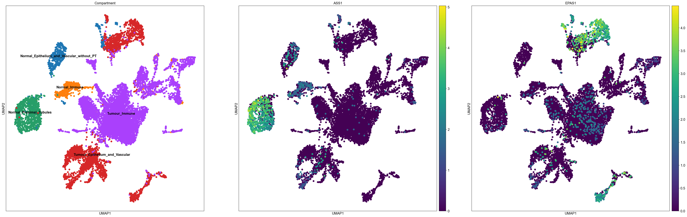
    


```python
sc.pl.violin(adata, ['ASS1', 'EPAS1'], groupby='Compartment', size = 10)
```


    
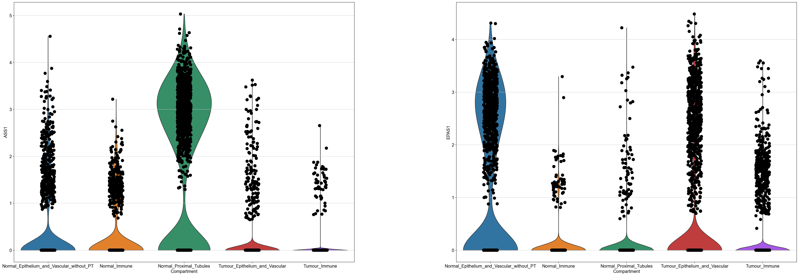
    


```python
adata_filtered_patient_epith = adata_filtered_patient[np.isin(adata_filtered_patient.obs.Compartment, ['Normal_Epithelium_and_Vascular_without_PT','Tumour_Epithelium_and_Vascular'])].raw.to_adata()
df = sc.get.obs_df(adata_filtered_patient_epith, ['ASS1', 'Compartment'])
df = df.set_index('Compartment').stack().reset_index()
df.columns = ['Compartment', 'gene', 'value']
import seaborn as sns
#sns.violinplot(data=df, x='gene', y='value', hue="Compartment",
#                split=True, inner="quart", linewidth=1)  
sns.stripplot(data=df, x='gene', y='value', hue="Compartment",
                split=True)  
```

    /Users/aureliendugourd/opt/anaconda3/envs/sc/lib/python3.9/site-packages/seaborn/categorical.py:2805: UserWarning: The `split` parameter has been renamed to `dodge`.
      warnings.warn(msg, UserWarning)


    <AxesSubplot:xlabel='gene', ylabel='value'>


    
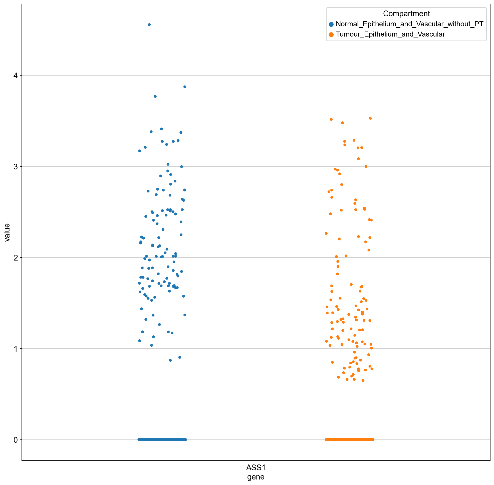
    


```python
adata_filtered_patient.obs['ASS1_expressed'] = adata_filtered_patient.raw.to_adata()[:,'ASS1'].X.A >  1.5
adata_filtered_patient.obs['ASS1_expressed'] = adata_filtered_patient.obs['ASS1_expressed'].astype(str)
```


```python
sc.pl.umap(adata_filtered_patient, color=['Compartment', 'ASS1','ASS1_expressed'], size=100, legend_loc='on data', )
```


    

    


```python
adata.obs['is_tumor'] = np.isin(adata.obs.Compartment, ['Tumour_Immune','Tumour_Epithelium_and_Vascular'])
adata.obs['is_tumor'] = adata.obs['is_tumor'].astype(str)
```


```python
adata.obs['Compartment'] = adata.obs['Compartment'].str.replace("Normal_","",regex = True)
adata.obs['Compartment'] = adata.obs['Compartment'].str.replace("Tumour_","",regex = True)
adata.obs['Compartment'] = adata.obs['Compartment'].str.replace("_without_PT","",regex = True)
```


```python
adata.obs['ASS1_expressed'] = adata.raw.to_adata()[:,'ASS1'].X.A >  1.5
adata.obs['ASS1_expressed'] = adata.obs['ASS1_expressed'].astype(str)
adata.obs['Compartment_ASS1'] = adata.obs['Compartment'].astype(str) + "_ASS1_expresed_is_" + adata.obs['ASS1_expressed'].astype(str)
```


```python
adata.obs['Compartment'].unique()
```


    array(['Epithelium_and_Vascular', 'Immune', 'Proximal_Tubules'],
          dtype=object)


```python
adata
```


    AnnData object with n_obs × n_vars = 14814 × 4765
        obs: 'barcode', 'SangerID', 'ClusterID', 'Compartment', 'nUMI', 'nGenes', 'MTfrac', 'QCpass', 'Source', 'n_genes', 'n_genes_by_counts', 'total_counts', 'total_counts_mt', 'pct_counts_mt', 'is_tumor'
        var: 'gene_ids', 'n_cells', 'mt', 'n_cells_by_counts', 'mean_counts', 'pct_dropout_by_counts', 'total_counts', 'highly_variable', 'means', 'dispersions', 'dispersions_norm', 'mean', 'std'
        uns: 'log1p', 'hvg', 'pca', 'neighbors', 'umap', 'Compartment_colors'
        obsm: 'X_pca', 'X_umap'
        varm: 'PCs'
        layers: 'counts'
        obsp: 'distances', 'connectivities'


```python
adata.layers
```


    Layers with keys: counts


```python
padata = dc.get_pseudobulk(adata, sample_col='Source', groups_col='Compartment', layer='counts', min_prop=0.05, min_smpls=1)
```

    /Users/aureliendugourd/opt/anaconda3/envs/sc/lib/python3.9/site-packages/decoupler/utils_anndata.py:203: FutureWarning: X.dtype being converted to np.float32 from float64. In the next version of anndata (0.9) conversion will not be automatic. Pass dtype explicitly to avoid this warning. Pass `AnnData(X, dtype=X.dtype, ...)` to get the future behavour.
      psbulk = AnnData(psbulk, obs=new_obs, var=new_var)


```python
sc.pp.normalize_total(padata, target_sum=1e4)
sc.pp.log1p(padata)
padata
```

    normalizing counts per cell
        finished (0:00:00)


    /Users/aureliendugourd/opt/anaconda3/envs/sc/lib/python3.9/site-packages/scanpy/preprocessing/_normalization.py:170: UserWarning: Received a view of an AnnData. Making a copy.
      view_to_actual(adata)


    AnnData object with n_obs × n_vars = 35 × 3472
        obs: 'SangerID', 'Compartment', 'QCpass', 'Source', 'is_tumor'
        uns: 'log1p'


```python
logFCs, pvals = dc.get_contrast(padata,
                                group_col='Compartment',
                                condition_col='is_tumor',
                                condition='True',
                                reference='False',
                                method='t-test'
                               )
logFCs
```

    ranking genes
        finished: added to `.uns['rank_genes_groups']`
        'names', sorted np.recarray to be indexed by group ids
        'scores', sorted np.recarray to be indexed by group ids
        'logfoldchanges', sorted np.recarray to be indexed by group ids
        'pvals', sorted np.recarray to be indexed by group ids
        'pvals_adj', sorted np.recarray to be indexed by group ids (0:00:00)
    ranking genes
        finished: added to `.uns['rank_genes_groups']`
        'names', sorted np.recarray to be indexed by group ids
        'scores', sorted np.recarray to be indexed by group ids
        'logfoldchanges', sorted np.recarray to be indexed by group ids
        'pvals', sorted np.recarray to be indexed by group ids
        'pvals_adj', sorted np.recarray to be indexed by group ids (0:00:00)


    Skipping group "Proximal_Tubules" since condition "True" not in column "is_tumor".


<div>
<style scoped>
    .dataframe tbody tr th:only-of-type {
        vertical-align: middle;
    }

    .dataframe tbody tr th {
        vertical-align: top;
    }

    .dataframe thead th {
        text-align: right;
    }
</style>
<table border="1" class="dataframe">
  <thead>
    <tr style="text-align: right;">
      <th></th>
      <th>AP006222.2</th>
      <th>HES4</th>
      <th>ISG15</th>
      <th>AGRN</th>
      <th>TNFRSF18</th>
      <th>TNFRSF4</th>
      <th>FAM132A</th>
      <th>ACAP3</th>
      <th>CPTP</th>
      <th>MXRA8</th>
      <th>...</th>
      <th>TRPM2</th>
      <th>PTTG1IP</th>
      <th>FAM207A</th>
      <th>COL18A1</th>
      <th>COL6A1</th>
      <th>COL6A2</th>
      <th>FTCD</th>
      <th>S100B</th>
      <th>AL592183.1</th>
      <th>AC007325.4</th>
    </tr>
  </thead>
  <tbody>
    <tr>
      <th>Epithelium_and_Vascular</th>
      <td>0.613975</td>
      <td>0.374335</td>
      <td>-0.332842</td>
      <td>0.299694</td>
      <td>0.0</td>
      <td>1.049814</td>
      <td>0.0</td>
      <td>0.0</td>
      <td>-0.832969</td>
      <td>2.069736</td>
      <td>...</td>
      <td>0.0</td>
      <td>-0.291265</td>
      <td>1.126061</td>
      <td>0.699535</td>
      <td>-0.219978</td>
      <td>1.238503</td>
      <td>-5.40556</td>
      <td>2.824934</td>
      <td>-0.483405</td>
      <td>-0.55394</td>
    </tr>
    <tr>
      <th>Immune</th>
      <td>-0.143486</td>
      <td>-1.195635</td>
      <td>-0.330265</td>
      <td>0.0</td>
      <td>1.470405</td>
      <td>1.948553</td>
      <td>0.0</td>
      <td>-0.928518</td>
      <td>0.0</td>
      <td>0.0</td>
      <td>...</td>
      <td>1.532285</td>
      <td>0.347125</td>
      <td>0.123852</td>
      <td>0.23198</td>
      <td>1.177403</td>
      <td>-0.891592</td>
      <td>-5.959839</td>
      <td>-0.990714</td>
      <td>-0.229301</td>
      <td>-0.674796</td>
    </tr>
  </tbody>
</table>
<p>2 rows × 3472 columns</p>
</div>


```python
logFCs[logFCs.columns] = logFCs[logFCs.columns].apply(pd.to_numeric)
```


```python
logFCs.values
```


    array([[ 0.61397463,  0.37433505, -0.33284244, ...,  2.82493448,
            -0.48340499, -0.55393994],
           [-0.14348647, -1.19563544, -0.3302654 , ..., -0.99071419,
            -0.2293008 , -0.67479599]])


```python
deg = dc.format_contrast_results(logFCs, pvals)
deg[deg["contrast"] == 'Epithelium_and_Vascular'].head(50)
```


<div>
<style scoped>
    .dataframe tbody tr th:only-of-type {
        vertical-align: middle;
    }

    .dataframe tbody tr th {
        vertical-align: top;
    }

    .dataframe thead th {
        text-align: right;
    }
</style>
<table border="1" class="dataframe">
  <thead>
    <tr style="text-align: right;">
      <th></th>
      <th>contrast</th>
      <th>name</th>
      <th>logFC</th>
      <th>pval</th>
    </tr>
  </thead>
  <tbody>
    <tr>
      <th>1</th>
      <td>Epithelium_and_Vascular</td>
      <td>NDUFA4L2</td>
      <td>9.675441</td>
      <td>0.0</td>
    </tr>
    <tr>
      <th>3</th>
      <td>Epithelium_and_Vascular</td>
      <td>CD68</td>
      <td>5.374890</td>
      <td>0.0</td>
    </tr>
    <tr>
      <th>4</th>
      <td>Epithelium_and_Vascular</td>
      <td>NUPR1</td>
      <td>3.096303</td>
      <td>0.0</td>
    </tr>
    <tr>
      <th>6</th>
      <td>Epithelium_and_Vascular</td>
      <td>RP11-798K3.2</td>
      <td>3.148249</td>
      <td>0.000001</td>
    </tr>
    <tr>
      <th>8</th>
      <td>Epithelium_and_Vascular</td>
      <td>MAP3K7CL</td>
      <td>4.525923</td>
      <td>0.000001</td>
    </tr>
    <tr>
      <th>9</th>
      <td>Epithelium_and_Vascular</td>
      <td>C8orf4</td>
      <td>-4.470471</td>
      <td>0.000001</td>
    </tr>
    <tr>
      <th>10</th>
      <td>Epithelium_and_Vascular</td>
      <td>MIR210HG</td>
      <td>3.859733</td>
      <td>0.000001</td>
    </tr>
    <tr>
      <th>12</th>
      <td>Epithelium_and_Vascular</td>
      <td>RP11-356J5.12</td>
      <td>4.853344</td>
      <td>0.000002</td>
    </tr>
    <tr>
      <th>13</th>
      <td>Epithelium_and_Vascular</td>
      <td>GNG7</td>
      <td>-2.806815</td>
      <td>0.000002</td>
    </tr>
    <tr>
      <th>14</th>
      <td>Epithelium_and_Vascular</td>
      <td>NNMT</td>
      <td>5.728784</td>
      <td>0.000002</td>
    </tr>
    <tr>
      <th>16</th>
      <td>Epithelium_and_Vascular</td>
      <td>TMEM91</td>
      <td>2.978225</td>
      <td>0.000003</td>
    </tr>
    <tr>
      <th>17</th>
      <td>Epithelium_and_Vascular</td>
      <td>HOXB6</td>
      <td>-3.210516</td>
      <td>0.000003</td>
    </tr>
    <tr>
      <th>19</th>
      <td>Epithelium_and_Vascular</td>
      <td>TNFAIP6</td>
      <td>5.961462</td>
      <td>0.000004</td>
    </tr>
    <tr>
      <th>22</th>
      <td>Epithelium_and_Vascular</td>
      <td>C1QA</td>
      <td>3.174314</td>
      <td>0.000008</td>
    </tr>
    <tr>
      <th>23</th>
      <td>Epithelium_and_Vascular</td>
      <td>RGS1</td>
      <td>2.917495</td>
      <td>0.000009</td>
    </tr>
    <tr>
      <th>24</th>
      <td>Epithelium_and_Vascular</td>
      <td>PLAT</td>
      <td>-6.438141</td>
      <td>0.000014</td>
    </tr>
    <tr>
      <th>26</th>
      <td>Epithelium_and_Vascular</td>
      <td>ANO10</td>
      <td>-1.680533</td>
      <td>0.000016</td>
    </tr>
    <tr>
      <th>27</th>
      <td>Epithelium_and_Vascular</td>
      <td>GGT1</td>
      <td>2.689535</td>
      <td>0.000016</td>
    </tr>
    <tr>
      <th>28</th>
      <td>Epithelium_and_Vascular</td>
      <td>C1QB</td>
      <td>3.387144</td>
      <td>0.000019</td>
    </tr>
    <tr>
      <th>30</th>
      <td>Epithelium_and_Vascular</td>
      <td>LINC00887</td>
      <td>3.812608</td>
      <td>0.000023</td>
    </tr>
    <tr>
      <th>31</th>
      <td>Epithelium_and_Vascular</td>
      <td>GSTO2</td>
      <td>-2.536687</td>
      <td>0.000026</td>
    </tr>
    <tr>
      <th>33</th>
      <td>Epithelium_and_Vascular</td>
      <td>TCEAL2</td>
      <td>-7.158012</td>
      <td>0.000035</td>
    </tr>
    <tr>
      <th>36</th>
      <td>Epithelium_and_Vascular</td>
      <td>CTHRC1</td>
      <td>3.610456</td>
      <td>0.00004</td>
    </tr>
    <tr>
      <th>37</th>
      <td>Epithelium_and_Vascular</td>
      <td>PLEKHA4</td>
      <td>2.581850</td>
      <td>0.000043</td>
    </tr>
    <tr>
      <th>41</th>
      <td>Epithelium_and_Vascular</td>
      <td>CRYAB</td>
      <td>2.599291</td>
      <td>0.000049</td>
    </tr>
    <tr>
      <th>44</th>
      <td>Epithelium_and_Vascular</td>
      <td>ID1</td>
      <td>-4.299680</td>
      <td>0.000057</td>
    </tr>
    <tr>
      <th>45</th>
      <td>Epithelium_and_Vascular</td>
      <td>CDCA2</td>
      <td>31.414299</td>
      <td>0.000058</td>
    </tr>
    <tr>
      <th>46</th>
      <td>Epithelium_and_Vascular</td>
      <td>EMCN</td>
      <td>-5.594628</td>
      <td>0.000059</td>
    </tr>
    <tr>
      <th>47</th>
      <td>Epithelium_and_Vascular</td>
      <td>PDK1</td>
      <td>3.580265</td>
      <td>0.000066</td>
    </tr>
    <tr>
      <th>48</th>
      <td>Epithelium_and_Vascular</td>
      <td>MYEOV</td>
      <td>7.643384</td>
      <td>0.000069</td>
    </tr>
    <tr>
      <th>51</th>
      <td>Epithelium_and_Vascular</td>
      <td>MS4A6A</td>
      <td>3.379520</td>
      <td>0.000074</td>
    </tr>
    <tr>
      <th>52</th>
      <td>Epithelium_and_Vascular</td>
      <td>ZNF503</td>
      <td>-2.868580</td>
      <td>0.000078</td>
    </tr>
    <tr>
      <th>53</th>
      <td>Epithelium_and_Vascular</td>
      <td>ODF3B</td>
      <td>2.715940</td>
      <td>0.00008</td>
    </tr>
    <tr>
      <th>54</th>
      <td>Epithelium_and_Vascular</td>
      <td>C5orf46</td>
      <td>33.338634</td>
      <td>0.00008</td>
    </tr>
    <tr>
      <th>55</th>
      <td>Epithelium_and_Vascular</td>
      <td>TYMS</td>
      <td>4.965039</td>
      <td>0.000081</td>
    </tr>
    <tr>
      <th>56</th>
      <td>Epithelium_and_Vascular</td>
      <td>ALOX5AP</td>
      <td>3.135681</td>
      <td>0.000081</td>
    </tr>
    <tr>
      <th>57</th>
      <td>Epithelium_and_Vascular</td>
      <td>PFKP</td>
      <td>3.006231</td>
      <td>0.000082</td>
    </tr>
    <tr>
      <th>58</th>
      <td>Epithelium_and_Vascular</td>
      <td>SDC2</td>
      <td>1.911051</td>
      <td>0.000083</td>
    </tr>
    <tr>
      <th>59</th>
      <td>Epithelium_and_Vascular</td>
      <td>WBP5</td>
      <td>-1.274396</td>
      <td>0.000084</td>
    </tr>
    <tr>
      <th>62</th>
      <td>Epithelium_and_Vascular</td>
      <td>ZNF667-AS1</td>
      <td>-3.198778</td>
      <td>0.00009</td>
    </tr>
    <tr>
      <th>63</th>
      <td>Epithelium_and_Vascular</td>
      <td>TGFBI</td>
      <td>5.456276</td>
      <td>0.000096</td>
    </tr>
    <tr>
      <th>64</th>
      <td>Epithelium_and_Vascular</td>
      <td>CDH6</td>
      <td>3.613546</td>
      <td>0.000105</td>
    </tr>
    <tr>
      <th>65</th>
      <td>Epithelium_and_Vascular</td>
      <td>ANGPTL4</td>
      <td>5.764848</td>
      <td>0.000107</td>
    </tr>
    <tr>
      <th>67</th>
      <td>Epithelium_and_Vascular</td>
      <td>APOC1</td>
      <td>4.985744</td>
      <td>0.00012</td>
    </tr>
    <tr>
      <th>69</th>
      <td>Epithelium_and_Vascular</td>
      <td>GLYR1</td>
      <td>-1.993001</td>
      <td>0.000125</td>
    </tr>
    <tr>
      <th>70</th>
      <td>Epithelium_and_Vascular</td>
      <td>CXCL12</td>
      <td>-4.026537</td>
      <td>0.000129</td>
    </tr>
    <tr>
      <th>71</th>
      <td>Epithelium_and_Vascular</td>
      <td>SLC14A1</td>
      <td>-5.516157</td>
      <td>0.000144</td>
    </tr>
    <tr>
      <th>72</th>
      <td>Epithelium_and_Vascular</td>
      <td>ASS1</td>
      <td>-2.087314</td>
      <td>0.000153</td>
    </tr>
    <tr>
      <th>73</th>
      <td>Epithelium_and_Vascular</td>
      <td>SYTL2</td>
      <td>3.762934</td>
      <td>0.000155</td>
    </tr>
    <tr>
      <th>75</th>
      <td>Epithelium_and_Vascular</td>
      <td>CCL5</td>
      <td>2.607181</td>
      <td>0.000166</td>
    </tr>
  </tbody>
</table>
</div>


```python
deg[deg["name"] == "ASS1"]
```


<div>
<style scoped>
    .dataframe tbody tr th:only-of-type {
        vertical-align: middle;
    }

    .dataframe tbody tr th {
        vertical-align: top;
    }

    .dataframe thead th {
        text-align: right;
    }
</style>
<table border="1" class="dataframe">
  <thead>
    <tr style="text-align: right;">
      <th></th>
      <th>contrast</th>
      <th>name</th>
      <th>logFC</th>
      <th>pval</th>
    </tr>
  </thead>
  <tbody>
    <tr>
      <th>72</th>
      <td>Epithelium_and_Vascular</td>
      <td>ASS1</td>
      <td>-2.087314</td>
      <td>0.000153</td>
    </tr>
    <tr>
      <th>259</th>
      <td>Immune</td>
      <td>ASS1</td>
      <td>-4.868311</td>
      <td>0.002029</td>
    </tr>
  </tbody>
</table>
</div>


```python
deg[deg["name"] == "BCAT1"]
```


<div>
<style scoped>
    .dataframe tbody tr th:only-of-type {
        vertical-align: middle;
    }

    .dataframe tbody tr th {
        vertical-align: top;
    }

    .dataframe thead th {
        text-align: right;
    }
</style>
<table border="1" class="dataframe">
  <thead>
    <tr style="text-align: right;">
      <th></th>
      <th>contrast</th>
      <th>name</th>
      <th>logFC</th>
      <th>pval</th>
    </tr>
  </thead>
  <tbody>
    <tr>
      <th>501</th>
      <td>Immune</td>
      <td>BCAT1</td>
      <td>1.613585</td>
      <td>0.007516</td>
    </tr>
    <tr>
      <th>6751</th>
      <td>Epithelium_and_Vascular</td>
      <td>BCAT1</td>
      <td>0.0</td>
      <td>1.0</td>
    </tr>
  </tbody>
</table>
</div>


```python
deg[deg["name"] == "GLUL"]
```


<div>
<style scoped>
    .dataframe tbody tr th:only-of-type {
        vertical-align: middle;
    }

    .dataframe tbody tr th {
        vertical-align: top;
    }

    .dataframe thead th {
        text-align: right;
    }
</style>
<table border="1" class="dataframe">
  <thead>
    <tr style="text-align: right;">
      <th></th>
      <th>contrast</th>
      <th>name</th>
      <th>logFC</th>
      <th>pval</th>
    </tr>
  </thead>
  <tbody>
    <tr>
      <th>1651</th>
      <td>Epithelium_and_Vascular</td>
      <td>GLUL</td>
      <td>-0.743209</td>
      <td>0.075129</td>
    </tr>
    <tr>
      <th>3240</th>
      <td>Immune</td>
      <td>GLUL</td>
      <td>0.190113</td>
      <td>0.378176</td>
    </tr>
  </tbody>
</table>
</div>


```python
# Retrieve PROGENy model weights
progeny = dc.get_progeny(top=300)

# Infer pathway activities with mlm
pathway_acts, pathway_pvals = dc.run_mlm(mat=logFCs, net=progeny, source='source', target='target', weight='weight', )
pathway_acts
```


<div>
<style scoped>
    .dataframe tbody tr th:only-of-type {
        vertical-align: middle;
    }

    .dataframe tbody tr th {
        vertical-align: top;
    }

    .dataframe thead th {
        text-align: right;
    }
</style>
<table border="1" class="dataframe">
  <thead>
    <tr style="text-align: right;">
      <th></th>
      <th>Androgen</th>
      <th>EGFR</th>
      <th>Estrogen</th>
      <th>Hypoxia</th>
      <th>JAK-STAT</th>
      <th>MAPK</th>
      <th>NFkB</th>
      <th>PI3K</th>
      <th>TGFb</th>
      <th>TNFa</th>
      <th>Trail</th>
      <th>VEGF</th>
      <th>WNT</th>
      <th>p53</th>
    </tr>
  </thead>
  <tbody>
    <tr>
      <th>Epithelium_and_Vascular</th>
      <td>-0.707693</td>
      <td>0.176828</td>
      <td>0.031855</td>
      <td>4.776238</td>
      <td>0.268307</td>
      <td>-0.370665</td>
      <td>0.524252</td>
      <td>-0.400176</td>
      <td>0.716039</td>
      <td>-0.063259</td>
      <td>-2.797865</td>
      <td>-0.580725</td>
      <td>0.297175</td>
      <td>0.906875</td>
    </tr>
    <tr>
      <th>Immune</th>
      <td>-0.275713</td>
      <td>-0.032075</td>
      <td>-0.340525</td>
      <td>3.547448</td>
      <td>1.281368</td>
      <td>-0.120525</td>
      <td>0.124793</td>
      <td>0.114026</td>
      <td>1.680650</td>
      <td>0.433120</td>
      <td>-1.419457</td>
      <td>-0.561339</td>
      <td>0.448164</td>
      <td>0.803918</td>
    </tr>
  </tbody>
</table>
</div>


```python
progeny
```


<div>
<style scoped>
    .dataframe tbody tr th:only-of-type {
        vertical-align: middle;
    }

    .dataframe tbody tr th {
        vertical-align: top;
    }

    .dataframe thead th {
        text-align: right;
    }
</style>
<table border="1" class="dataframe">
  <thead>
    <tr style="text-align: right;">
      <th></th>
      <th>source</th>
      <th>target</th>
      <th>weight</th>
      <th>p_value</th>
    </tr>
  </thead>
  <tbody>
    <tr>
      <th>0</th>
      <td>Androgen</td>
      <td>TMPRSS2</td>
      <td>11.490631</td>
      <td>0.000000e+00</td>
    </tr>
    <tr>
      <th>1</th>
      <td>Androgen</td>
      <td>NKX3-1</td>
      <td>10.622551</td>
      <td>2.242078e-44</td>
    </tr>
    <tr>
      <th>2</th>
      <td>Androgen</td>
      <td>MBOAT2</td>
      <td>10.472733</td>
      <td>4.624285e-44</td>
    </tr>
    <tr>
      <th>3</th>
      <td>Androgen</td>
      <td>KLK2</td>
      <td>10.176186</td>
      <td>1.944414e-40</td>
    </tr>
    <tr>
      <th>4</th>
      <td>Androgen</td>
      <td>SARG</td>
      <td>11.386852</td>
      <td>2.790209e-40</td>
    </tr>
    <tr>
      <th>...</th>
      <td>...</td>
      <td>...</td>
      <td>...</td>
      <td>...</td>
    </tr>
    <tr>
      <th>4195</th>
      <td>p53</td>
      <td>F5</td>
      <td>2.397854</td>
      <td>5.746843e-08</td>
    </tr>
    <tr>
      <th>4196</th>
      <td>p53</td>
      <td>MKI67</td>
      <td>-5.680340</td>
      <td>5.758565e-08</td>
    </tr>
    <tr>
      <th>4197</th>
      <td>p53</td>
      <td>THOC2</td>
      <td>-2.108178</td>
      <td>5.858359e-08</td>
    </tr>
    <tr>
      <th>4198</th>
      <td>p53</td>
      <td>POLA1</td>
      <td>-4.943873</td>
      <td>5.911873e-08</td>
    </tr>
    <tr>
      <th>4199</th>
      <td>p53</td>
      <td>TMEM52</td>
      <td>2.596648</td>
      <td>6.576950e-08</td>
    </tr>
  </tbody>
</table>
<p>4200 rows × 4 columns</p>
</div>


```python
# Retrieve DoRothEA gene regulatory network
dorothea = dc.get_dorothea()

# Infer pathway activities with mlm
tf_acts, tf_pvals = dc.run_mlm(mat=logFCs, net=dorothea, source='source', target='target', weight='weight')
tf_acts
```


      0%|          | 0.00/51.4M [00:00<?, ?B/s]


    /Users/aureliendugourd/opt/anaconda3/envs/sc/lib/python3.9/site-packages/omnipath/_core/requests/_request.py:39: FutureWarning: The squeeze argument has been deprecated and will be removed in a future version. Append .squeeze("columns") to the call to squeeze.
    
    
      res: pd.DataFrame = callback(*args, **kwargs)


    ---------------------------------------------------------------------------

    TypeError                                 Traceback (most recent call last)

    File ~/opt/anaconda3/envs/sc/lib/python3.9/site-packages/scipy/sparse/_base.py:376, in spmatrix.asformat(self, format, copy)
        375 try:
    --> 376     return convert_method(copy=copy)
        377 except TypeError:


    File ~/opt/anaconda3/envs/sc/lib/python3.9/site-packages/scipy/sparse/_coo.py:402, in coo_matrix.tocsr(self, copy)
        401 indices = np.empty_like(col, dtype=idx_dtype)
    --> 402 data = np.empty_like(self.data, dtype=upcast(self.dtype))
        404 coo_tocsr(M, N, self.nnz, row, col, self.data,
        405           indptr, indices, data)


    File ~/opt/anaconda3/envs/sc/lib/python3.9/site-packages/scipy/sparse/_sputils.py:51, in upcast(*args)
         49         return t
    ---> 51 raise TypeError('no supported conversion for types: %r' % (args,))


    TypeError: no supported conversion for types: (dtype('O'),)

    
    During handling of the above exception, another exception occurred:


    TypeError                                 Traceback (most recent call last)

    Input In [81], in <cell line: 5>()
          2 dorothea = dc.get_dorothea()
          4 # Infer pathway activities with mlm
    ----> 5 tf_acts, tf_pvals = dc.run_mlm(mat=logFCs, net=dorothea, source='source', target='target', weight='weight')
          6 tf_acts


    File ~/opt/anaconda3/envs/sc/lib/python3.9/site-packages/decoupler/method_mlm.py:107, in run_mlm(mat, net, source, target, weight, batch_size, min_n, verbose, use_raw)
         70 """
         71 Multivariate Linear Model (MLM).
         72 
       (...)
        103     Obtained p-values. Stored in `.obsm['mlm_pvals']` if `mat` is AnnData.
        104 """
        106 # Extract sparse matrix and array of genes
    --> 107 m, r, c = extract(mat, use_raw=use_raw, verbose=verbose)
        109 # Transform net
        110 net = rename_net(net, source=source, target=target, weight=weight)


    File ~/opt/anaconda3/envs/sc/lib/python3.9/site-packages/decoupler/pre.py:42, in extract(mat, use_raw, verbose, dtype)
         40     c = np.array(c)
         41 elif type(mat) is pd.DataFrame:
    ---> 42     m = csr_matrix(mat.values)
         43     r = mat.index.values
         44     c = mat.columns.values


    File ~/opt/anaconda3/envs/sc/lib/python3.9/site-packages/scipy/sparse/_compressed.py:84, in _cs_matrix.__init__(self, arg1, shape, dtype, copy)
         81     except Exception as e:
         82         raise ValueError("unrecognized {}_matrix constructor usage"
         83                          "".format(self.format)) from e
    ---> 84     self._set_self(self.__class__(
         85         self._coo_container(arg1, dtype=dtype)
         86     ))
         88 # Read matrix dimensions given, if any
         89 if shape is not None:


    File ~/opt/anaconda3/envs/sc/lib/python3.9/site-packages/scipy/sparse/_compressed.py:33, in _cs_matrix.__init__(self, arg1, shape, dtype, copy)
         31         arg1 = arg1.copy()
         32     else:
    ---> 33         arg1 = arg1.asformat(self.format)
         34     self._set_self(arg1)
         36 elif isinstance(arg1, tuple):


    File ~/opt/anaconda3/envs/sc/lib/python3.9/site-packages/scipy/sparse/_base.py:378, in spmatrix.asformat(self, format, copy)
        376     return convert_method(copy=copy)
        377 except TypeError:
    --> 378     return convert_method()


    File ~/opt/anaconda3/envs/sc/lib/python3.9/site-packages/scipy/sparse/_coo.py:402, in coo_matrix.tocsr(self, copy)
        400 indptr = np.empty(M + 1, dtype=idx_dtype)
        401 indices = np.empty_like(col, dtype=idx_dtype)
    --> 402 data = np.empty_like(self.data, dtype=upcast(self.dtype))
        404 coo_tocsr(M, N, self.nnz, row, col, self.data,
        405           indptr, indices, data)
        407 x = self._csr_container((data, indices, indptr), shape=self.shape)


    File ~/opt/anaconda3/envs/sc/lib/python3.9/site-packages/scipy/sparse/_sputils.py:51, in upcast(*args)
         48         _upcast_memo[hash(args)] = t
         49         return t
    ---> 51 raise TypeError('no supported conversion for types: %r' % (args,))


    TypeError: no supported conversion for types: (dtype('O'),)


```python

```


```python
padata_ASS1 = dc.get_pseudobulk(adata, sample_col='Source', groups_col='Compartment_ASS1', layer='counts', min_prop=0.05, min_smpls=1)
sc.pp.normalize_total(padata_ASS1, target_sum=1e4)
sc.pp.log1p(padata_ASS1)
padata_ASS1
```

    normalizing counts per cell
        finished (0:00:00)


    /Users/aureliendugourd/opt/anaconda3/envs/sc/lib/python3.9/site-packages/decoupler/utils_anndata.py:203: FutureWarning: X.dtype being converted to np.float32 from float64. In the next version of anndata (0.9) conversion will not be automatic. Pass dtype explicitly to avoid this warning. Pass `AnnData(X, dtype=X.dtype, ...)` to get the future behavour.
      psbulk = AnnData(psbulk, obs=new_obs, var=new_var)
    /Users/aureliendugourd/opt/anaconda3/envs/sc/lib/python3.9/site-packages/scanpy/preprocessing/_normalization.py:170: UserWarning: Received a view of an AnnData. Making a copy.
      view_to_actual(adata)


    AnnData object with n_obs × n_vars = 52 × 4053
        obs: 'SangerID', 'Compartment', 'QCpass', 'Source', 'is_tumor', 'ASS1_expressed', 'Compartment_ASS1'
        uns: 'log1p'


```python
padata_ASS1.obs.Compartment_ASS1.unique()
```


    array(['Epithelium_and_Vascular_ASS1_expresed_is_False',
           'Epithelium_and_Vascular_ASS1_expresed_is_True',
           'Immune_ASS1_expresed_is_False', 'Immune_ASS1_expresed_is_True',
           'Proximal_Tubules_ASS1_expresed_is_False',
           'Proximal_Tubules_ASS1_expresed_is_True'], dtype=object)


```python
logFCs, pvals = dc.get_contrast(padata_ASS1,
                                group_col='is_tumor',
                                condition_col='Compartment_ASS1',
                                condition='Epithelium_and_Vascular_ASS1_expresed_is_True',
                                reference='Epithelium_and_Vascular_ASS1_expresed_is_False',
                                method='t-test'
                               )
logFCs
```

    ranking genes
        finished: added to `.uns['rank_genes_groups']`
        'names', sorted np.recarray to be indexed by group ids
        'scores', sorted np.recarray to be indexed by group ids
        'logfoldchanges', sorted np.recarray to be indexed by group ids
        'pvals', sorted np.recarray to be indexed by group ids
        'pvals_adj', sorted np.recarray to be indexed by group ids (0:00:00)
    ranking genes
        finished: added to `.uns['rank_genes_groups']`
        'names', sorted np.recarray to be indexed by group ids
        'scores', sorted np.recarray to be indexed by group ids
        'logfoldchanges', sorted np.recarray to be indexed by group ids
        'pvals', sorted np.recarray to be indexed by group ids
        'pvals_adj', sorted np.recarray to be indexed by group ids (0:00:00)


<div>
<style scoped>
    .dataframe tbody tr th:only-of-type {
        vertical-align: middle;
    }

    .dataframe tbody tr th {
        vertical-align: top;
    }

    .dataframe thead th {
        text-align: right;
    }
</style>
<table border="1" class="dataframe">
  <thead>
    <tr style="text-align: right;">
      <th></th>
      <th>AP006222.2</th>
      <th>FAM41C</th>
      <th>HES4</th>
      <th>ISG15</th>
      <th>AGRN</th>
      <th>TNFRSF18</th>
      <th>TNFRSF4</th>
      <th>FAM132A</th>
      <th>ACAP3</th>
      <th>CPTP</th>
      <th>...</th>
      <th>FAM207A</th>
      <th>COL18A1</th>
      <th>COL6A1</th>
      <th>COL6A2</th>
      <th>FTCD</th>
      <th>SPATC1L</th>
      <th>S100B</th>
      <th>AC011043.1</th>
      <th>AL592183.1</th>
      <th>AC007325.4</th>
    </tr>
  </thead>
  <tbody>
    <tr>
      <th>False</th>
      <td>0.007364</td>
      <td>0.0</td>
      <td>-30.363365</td>
      <td>-0.832573</td>
      <td>0.218236</td>
      <td>0.0</td>
      <td>-28.960226</td>
      <td>0.0</td>
      <td>0.0</td>
      <td>0.278059</td>
      <td>...</td>
      <td>-0.226724</td>
      <td>-0.431412</td>
      <td>-0.2556</td>
      <td>-30.108658</td>
      <td>1.124529</td>
      <td>0.0</td>
      <td>-24.343605</td>
      <td>29.261204</td>
      <td>0.719766</td>
      <td>0.246272</td>
    </tr>
    <tr>
      <th>True</th>
      <td>-0.205997</td>
      <td>0.0</td>
      <td>-30.758904</td>
      <td>-0.54509</td>
      <td>-29.935829</td>
      <td>29.110435</td>
      <td>-30.347652</td>
      <td>0.0</td>
      <td>0.0</td>
      <td>0.123062</td>
      <td>...</td>
      <td>0.489754</td>
      <td>-2.497118</td>
      <td>-0.691138</td>
      <td>-31.25865</td>
      <td>-24.391277</td>
      <td>0.0</td>
      <td>-26.954243</td>
      <td>28.634207</td>
      <td>-29.058884</td>
      <td>1.096547</td>
    </tr>
  </tbody>
</table>
<p>2 rows × 4053 columns</p>
</div>


```python
logFCs[logFCs.columns] = logFCs[logFCs.columns].apply(pd.to_numeric)
```


```python
deg_ASS1 = dc.format_contrast_results(logFCs, pvals)
deg_ASS1[deg_ASS1["contrast"] == 'True'].head(50)
```


<div>
<style scoped>
    .dataframe tbody tr th:only-of-type {
        vertical-align: middle;
    }

    .dataframe tbody tr th {
        vertical-align: top;
    }

    .dataframe thead th {
        text-align: right;
    }
</style>
<table border="1" class="dataframe">
  <thead>
    <tr style="text-align: right;">
      <th></th>
      <th>contrast</th>
      <th>name</th>
      <th>logFC</th>
      <th>pval</th>
    </tr>
  </thead>
  <tbody>
    <tr>
      <th>0</th>
      <td>True</td>
      <td>PHACTR1</td>
      <td>-29.941156</td>
      <td>0.0</td>
    </tr>
    <tr>
      <th>1</th>
      <td>True</td>
      <td>GOSR2</td>
      <td>-29.976879</td>
      <td>0.0</td>
    </tr>
    <tr>
      <th>2</th>
      <td>True</td>
      <td>ABHD11</td>
      <td>-30.345949</td>
      <td>0.000001</td>
    </tr>
    <tr>
      <th>3</th>
      <td>True</td>
      <td>TMEM192</td>
      <td>-30.371525</td>
      <td>0.000002</td>
    </tr>
    <tr>
      <th>4</th>
      <td>True</td>
      <td>TMEM120A</td>
      <td>1.910723</td>
      <td>0.000002</td>
    </tr>
    <tr>
      <th>5</th>
      <td>True</td>
      <td>TACO1</td>
      <td>-29.608528</td>
      <td>0.000003</td>
    </tr>
    <tr>
      <th>6</th>
      <td>True</td>
      <td>SEC24D</td>
      <td>-29.649244</td>
      <td>0.000004</td>
    </tr>
    <tr>
      <th>7</th>
      <td>True</td>
      <td>LINC00467</td>
      <td>-30.265038</td>
      <td>0.000007</td>
    </tr>
    <tr>
      <th>9</th>
      <td>True</td>
      <td>LRRC42</td>
      <td>-29.615204</td>
      <td>0.000007</td>
    </tr>
    <tr>
      <th>10</th>
      <td>True</td>
      <td>LRP1</td>
      <td>-29.917957</td>
      <td>0.000011</td>
    </tr>
    <tr>
      <th>11</th>
      <td>True</td>
      <td>ATP6V1B2</td>
      <td>-30.913229</td>
      <td>0.000024</td>
    </tr>
    <tr>
      <th>12</th>
      <td>True</td>
      <td>GTF2H1</td>
      <td>-30.081543</td>
      <td>0.000027</td>
    </tr>
    <tr>
      <th>13</th>
      <td>True</td>
      <td>LYPLA2</td>
      <td>-30.639891</td>
      <td>0.000036</td>
    </tr>
    <tr>
      <th>14</th>
      <td>True</td>
      <td>DOK4</td>
      <td>2.542495</td>
      <td>0.000061</td>
    </tr>
    <tr>
      <th>15</th>
      <td>True</td>
      <td>GPC6</td>
      <td>-30.143112</td>
      <td>0.000074</td>
    </tr>
    <tr>
      <th>16</th>
      <td>True</td>
      <td>NOP16</td>
      <td>-30.541618</td>
      <td>0.000074</td>
    </tr>
    <tr>
      <th>17</th>
      <td>True</td>
      <td>MXRA8</td>
      <td>-30.118883</td>
      <td>0.000078</td>
    </tr>
    <tr>
      <th>18</th>
      <td>True</td>
      <td>TFRC</td>
      <td>-29.738272</td>
      <td>0.000083</td>
    </tr>
    <tr>
      <th>20</th>
      <td>True</td>
      <td>UACA</td>
      <td>-31.718193</td>
      <td>0.00009</td>
    </tr>
    <tr>
      <th>22</th>
      <td>True</td>
      <td>C1QC</td>
      <td>-31.211809</td>
      <td>0.00011</td>
    </tr>
    <tr>
      <th>25</th>
      <td>True</td>
      <td>ENAH</td>
      <td>-30.155001</td>
      <td>0.000159</td>
    </tr>
    <tr>
      <th>26</th>
      <td>True</td>
      <td>PPIF</td>
      <td>-29.513226</td>
      <td>0.000175</td>
    </tr>
    <tr>
      <th>27</th>
      <td>True</td>
      <td>AZGP1</td>
      <td>-29.718884</td>
      <td>0.000192</td>
    </tr>
    <tr>
      <th>28</th>
      <td>True</td>
      <td>SORBS3</td>
      <td>-30.256453</td>
      <td>0.000208</td>
    </tr>
    <tr>
      <th>30</th>
      <td>True</td>
      <td>RASSF6</td>
      <td>-30.100594</td>
      <td>0.000238</td>
    </tr>
    <tr>
      <th>32</th>
      <td>True</td>
      <td>SDSL</td>
      <td>-29.007198</td>
      <td>0.000251</td>
    </tr>
    <tr>
      <th>33</th>
      <td>True</td>
      <td>MS4A4A</td>
      <td>-29.719744</td>
      <td>0.000267</td>
    </tr>
    <tr>
      <th>34</th>
      <td>True</td>
      <td>ABCD3</td>
      <td>-29.954901</td>
      <td>0.00028</td>
    </tr>
    <tr>
      <th>35</th>
      <td>True</td>
      <td>SNX4</td>
      <td>-30.333879</td>
      <td>0.000286</td>
    </tr>
    <tr>
      <th>36</th>
      <td>True</td>
      <td>CECR5</td>
      <td>-30.032261</td>
      <td>0.000308</td>
    </tr>
    <tr>
      <th>37</th>
      <td>True</td>
      <td>OAT</td>
      <td>-30.543346</td>
      <td>0.00031</td>
    </tr>
    <tr>
      <th>38</th>
      <td>True</td>
      <td>GLA</td>
      <td>-29.387812</td>
      <td>0.000328</td>
    </tr>
    <tr>
      <th>39</th>
      <td>True</td>
      <td>VTA1</td>
      <td>-29.597628</td>
      <td>0.000341</td>
    </tr>
    <tr>
      <th>41</th>
      <td>True</td>
      <td>COL4A2</td>
      <td>-32.318871</td>
      <td>0.000348</td>
    </tr>
    <tr>
      <th>42</th>
      <td>True</td>
      <td>PDK2</td>
      <td>-30.090960</td>
      <td>0.000349</td>
    </tr>
    <tr>
      <th>43</th>
      <td>True</td>
      <td>USP10</td>
      <td>-30.241341</td>
      <td>0.000351</td>
    </tr>
    <tr>
      <th>44</th>
      <td>True</td>
      <td>PDLIM3</td>
      <td>-30.176743</td>
      <td>0.000357</td>
    </tr>
    <tr>
      <th>45</th>
      <td>True</td>
      <td>DYNC2LI1</td>
      <td>1.451967</td>
      <td>0.000358</td>
    </tr>
    <tr>
      <th>47</th>
      <td>True</td>
      <td>UEVLD</td>
      <td>-29.267105</td>
      <td>0.000363</td>
    </tr>
    <tr>
      <th>48</th>
      <td>True</td>
      <td>COG7</td>
      <td>-29.233934</td>
      <td>0.000369</td>
    </tr>
    <tr>
      <th>49</th>
      <td>True</td>
      <td>PLRG1</td>
      <td>-30.432287</td>
      <td>0.000373</td>
    </tr>
    <tr>
      <th>50</th>
      <td>True</td>
      <td>PFN2</td>
      <td>2.096065</td>
      <td>0.000406</td>
    </tr>
    <tr>
      <th>51</th>
      <td>True</td>
      <td>HDHD2</td>
      <td>-29.792618</td>
      <td>0.000407</td>
    </tr>
    <tr>
      <th>52</th>
      <td>True</td>
      <td>COL4A1</td>
      <td>-32.563786</td>
      <td>0.00041</td>
    </tr>
    <tr>
      <th>53</th>
      <td>True</td>
      <td>MAGEF1</td>
      <td>-30.260969</td>
      <td>0.000415</td>
    </tr>
    <tr>
      <th>54</th>
      <td>True</td>
      <td>ADAMTS1</td>
      <td>-30.517302</td>
      <td>0.000416</td>
    </tr>
    <tr>
      <th>55</th>
      <td>True</td>
      <td>PRPS2</td>
      <td>-29.940687</td>
      <td>0.000417</td>
    </tr>
    <tr>
      <th>56</th>
      <td>True</td>
      <td>C11orf49</td>
      <td>-30.196718</td>
      <td>0.00042</td>
    </tr>
    <tr>
      <th>57</th>
      <td>True</td>
      <td>SDHAF3</td>
      <td>-30.434309</td>
      <td>0.00044</td>
    </tr>
    <tr>
      <th>58</th>
      <td>True</td>
      <td>GOT1</td>
      <td>-30.309772</td>
      <td>0.00044</td>
    </tr>
  </tbody>
</table>
</div>


```python
# Retrieve PROGENy model weights
progeny = dc.get_progeny(top=300)

# Infer pathway activities with mlm
pathway_acts, pathway_pvals = dc.run_mlm(mat=logFCs, net=progeny, source='source', target='target', weight='weight', )
pathway_acts
```


<div>
<style scoped>
    .dataframe tbody tr th:only-of-type {
        vertical-align: middle;
    }

    .dataframe tbody tr th {
        vertical-align: top;
    }

    .dataframe thead th {
        text-align: right;
    }
</style>
<table border="1" class="dataframe">
  <thead>
    <tr style="text-align: right;">
      <th></th>
      <th>Androgen</th>
      <th>EGFR</th>
      <th>Estrogen</th>
      <th>Hypoxia</th>
      <th>JAK-STAT</th>
      <th>MAPK</th>
      <th>NFkB</th>
      <th>PI3K</th>
      <th>TGFb</th>
      <th>TNFa</th>
      <th>Trail</th>
      <th>VEGF</th>
      <th>WNT</th>
      <th>p53</th>
    </tr>
  </thead>
  <tbody>
    <tr>
      <th>False</th>
      <td>-0.397546</td>
      <td>-2.641322</td>
      <td>0.057717</td>
      <td>-1.525136</td>
      <td>-0.959805</td>
      <td>1.232088</td>
      <td>-0.943543</td>
      <td>0.334000</td>
      <td>-1.037059</td>
      <td>-0.413430</td>
      <td>0.939772</td>
      <td>0.633600</td>
      <td>0.105350</td>
      <td>-1.028047</td>
    </tr>
    <tr>
      <th>True</th>
      <td>-1.105398</td>
      <td>-2.440396</td>
      <td>-1.970223</td>
      <td>1.958679</td>
      <td>0.327752</td>
      <td>1.391987</td>
      <td>0.854447</td>
      <td>-1.083415</td>
      <td>-1.283984</td>
      <td>-0.932082</td>
      <td>1.286764</td>
      <td>-0.632865</td>
      <td>-0.654019</td>
      <td>0.259859</td>
    </tr>
  </tbody>
</table>
</div>


```python
deg.to_csv(path_or_buf='../results/DA_tumorVsHealthy.csv')
```


```python
deg_ASS1.to_csv(path_or_buf='../results/DA_ASS1vsNoASS1.csv')
```


```python

```


```python

```


```python

```


```python

```


```python

```


```python

```


```python

```


```python

```


```python

```


```python

```


```python

```


```python

```


```python

```


```python

```


```python

```


```python

```


```python

```


```python

```


```python

```


```python

```


```python

```


```python

```


```python

```


```python

```


```python

```


```python

```


```python

```


```python

```


```python

```


```python

```


```python
adata_filtered_patient.obs
```


```python

```


```python

```


```python
adata_filtered_patient[:,'ASS1'].X > 2
```


```python

```


```python

```


```python

```


```python

```


```python

```


```python

```


```python

```


```python

```


```python

```


```python

```


```python

```


```python

```


```python

```


```python

```


```python

```


```python

```


```python

```


```python

```


```python

```


```python

```


```python

```


```python

```


```python

```


```python

```


```python

```


```python

```


```python

```


```python

```


```python

```


```python

```


```python

```


```python

```


```python

```


```python

```


```python

```


```python

```


```python

```


```python

```


```python

```


```python

```
